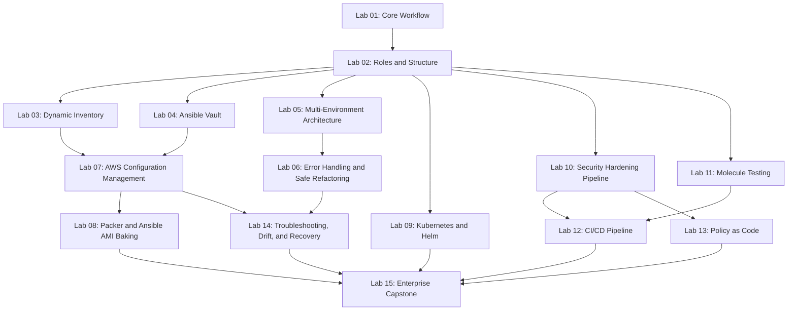

# Ansible Senior Interview Preparation

A production-grade Ansible interview preparation and hands-on learning repository for engineers targeting **Senior / Lead / Staff DevOps Engineer, Automation Engineer, Platform Engineer,** and **SRE** roles.

This is not a beginner Ansible tutorial. There are no "what is a playbook" questions here. Every question, lab, and diagram assumes you already run Ansible in production and is built around the failure modes, architecture decisions, security posture, testing discipline, and scale problems that actually come up at the 8–15+ year experience level.

## Who this is for

- Senior / Lead / Staff DevOps and Automation Engineers preparing for Ansible-heavy interviews
- Platform engineers who own configuration management, golden-image pipelines (Packer + Ansible), or AWX/Ansible Automation Platform
- SREs responsible for fleet-wide patching, drift correction, and incident response against Ansible-managed infrastructure
- Anyone who can already write a working playbook and now needs to reason about idempotency at scale, secrets handling, testing discipline, and organizational governance

## What's inside

| Area | Description |
|---|---|
| [`docs/`](docs/) | Deep-dive reference documentation: architecture, internals, inventory/variables, role design, security, testing, CI/CD, troubleshooting, HA/DR, cheat sheet index |
| [`interview-questions/`](interview-questions/) | 120 senior-level interview questions across 15 categories, each with a full scenario-based answer |
| [`labs/`](labs/) | 15 hands-on, executable labs that build on each other, from core workflow to a full enterprise capstone |
| [`roles/`](roles/) | Reusable production-style Ansible roles (`common`, `webserver`, `security-baseline`, `observability`, `database`) used across labs and the capstone |
| [`environments/`](environments/) | Dev / staging / production inventories and group_vars demonstrating environment isolation and promotion |
| [`policies/`](policies/) | Policy-as-code rules (custom `ansible-lint` rules and Conftest-style checks against rendered playbooks) enforced in Lab 13 |
| [`tests/`](tests/) | Molecule test scaffolding referenced by role-level tests |
| [`diagrams/`](diagrams/) | 15 Mermaid architecture and workflow diagrams |
| [`mock-interviews/`](mock-interviews/) | Three full mock interviews (Senior, Lead, Staff/Architect) with rubrics and model answers |
| [`cheatsheets/`](cheatsheets/) | Fast-reference sheets for CLI, inventory/variables, roles, Vault, CI/CD, testing, troubleshooting, AWS integration |
| [`.github/workflows/`](.github/workflows/) | Reference GitHub Actions pipeline used by Lab 12 (lint → molecule test → syntax-check → gated deploy) |
| [`scripts/`](scripts/) | Helper scripts referenced by specific labs |

## How to use this repository

**If you have 2–3 days before an interview:**
1. Read [`docs/interview-cheatsheet.md`](docs/interview-cheatsheet.md) and the [Interview Response Framework](#interview-response-framework) below.
2. Work through the [`interview-questions/`](interview-questions/) files for your weakest areas — start with `02-inventory-variables.md`, `10-troubleshooting.md`, and `15-leadership-design.md`, since these carry the most senior-level signal.
3. Run [Mock Interview 3](mock-interviews/mock-interview-03-staff-platform-architect.md) cold, then score yourself with the rubric.

**If you have 2–3 weeks:**
1. Work through Labs 1–15 in order (see the [Lab Dependency Map](#lab-dependency-map)).
2. Read the matching `docs/` chapter before each lab.
3. Answer the interview questions tied to each lab (linked at the bottom of every lab).
4. Finish with the enterprise capstone (Lab 15) and all three mock interviews.

**If you're building a real automation platform and want a reference architecture:**
- Use `roles/`, `environments/`, `policies/`, and Lab 15 as a starting point for a layered, multi-environment configuration-management platform.

## Prerequisites

- Ansible >= 2.16 / `ansible-core` >= 2.16 (version-specific behavior called out explicitly where relevant — verify against the [official Ansible documentation](https://docs.ansible.com/) before treating any version claim in this repo as permanent)
- Python 3.10+ (the control node's Python; managed-node Python requirements vary and are called out per lab)
- An AWS account for Labs 3, 7, 8 (dynamic inventory, configuration management against real EC2, Packer AMI baking) — a cost warning and cleanup procedure is included in every lab that touches AWS
- `ansible-lint`, `molecule` (with the `docker` or `podman` driver), `yamllint` — installation covered in Lab 10/11
- Basic familiarity with YAML, Jinja2, SSH, and Linux system administration (this repo does not re-teach those fundamentals)

## Cost warning

Labs 3, 7, and 8 create real, chargeable AWS resources (EC2 instances, AMI storage). Every such lab:
- Explicitly lists which resources cost money
- Provides a cost-conscious alternative where one exists (e.g., Molecule's Docker driver instead of real EC2 for most testing)
- Includes a mandatory cleanup section
- Requires you to independently verify current AWS pricing before running it — **no price in this repository should be treated as current or authoritative**

**Want to avoid AWS charges entirely?** [`../floci/floci-local-aws-setup/`](../floci/floci-local-aws-setup/README.md) covers running these labs against a local AWS emulator instead of a real account. Read [docs/ansible-integration.md](../floci/floci-local-aws-setup/docs/ansible-integration.md) before relying on it for Labs 3/7/8 specifically — Ansible's configuration-management labs need a real SSH-reachable host, and whether the emulator's EC2 instances are actually SSH-reachable is unverified; Molecule's Docker driver remains the better-tested cost-free path for role testing.

## Interview Response Framework

Every scenario-based answer in this repository — and every answer you should give live in an interview — follows this structure:

1. **Clarify the impact and scope** — what's actually broken, and who/what is affected right now
2. **Protect production before making changes** — stop the bleeding without introducing a second incident
3. **Gather evidence** — `-vvv` output, facts, inventory, logs, CI/CD history
4. **Inspect playbook, inventory, variables, target host state, and reality** — find where these diverge
5. **Identify the root cause** — not just the symptom
6. **Select the safest remediation** — prefer reversible, low-blast-radius actions first (check mode, `--limit`, `--diff`)
7. **Validate using check mode and independent host checks** — never trust a single source of truth
8. **Define rollback or recovery** — before you act, know how you'd undo it
9. **Add preventive controls** — molecule test, lint rule, role contract, or documentation change
10. **Document the operational decision** — for the next engineer and for audit

See [`docs/interview-cheatsheet.md`](docs/interview-cheatsheet.md) for the full cheat-sheet version of this framework.

## Lab Dependency Map

Labs 1–2 are strict prerequisites for everything else. From Lab 3 onward, the infrastructure-integration track (3→7→8) and the delivery track (10→11→12→13) can be done in either order before converging on the capstone (Lab 15).

## Repository status

This repository is built in phases. See [`PROJECT-ROADMAP.md`](PROJECT-ROADMAP.md) for current progress, what's complete, and what's still in progress. Do not assume every file referenced above exists yet until the roadmap marks it complete — check there first.
