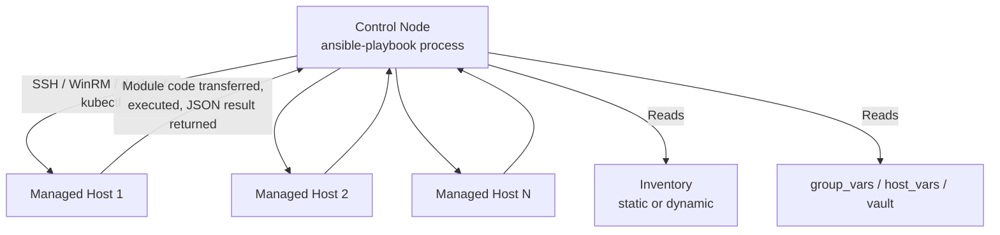

# Diagram 1: Ansible Execution Model

Referenced from [`docs/ansible-internals.md`](../docs/ansible-internals.md).

**Key points:**
- The control node does all the orchestration — parsing, variable resolution, templating — and only ships the actual module code to each managed host for execution.
- No persistent agent runs on managed hosts (agentless) — each connection is established fresh per task (or per play with `pipelining`/`ControlPersist`), unlike an agent-based CM tool.
- Connectivity is required control-node-to-host for every task in push mode — see [`docs/ha-dr.md`](../docs/ha-dr.md) for why this matters during a network partition.
