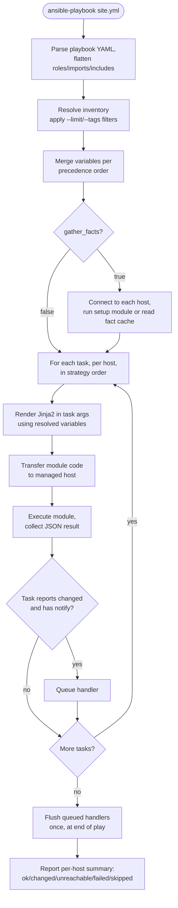

# Diagram 2: Playbook Run Workflow

Referenced from [`docs/ansible-internals.md`](../docs/ansible-internals.md#1-the-execution-model-end-to-end).

**Key points:**
- Variable merging happens once, per host, before any task executes — this is why a variable precedence mistake affects every task uniformly, not just one.
- Handlers are collected throughout the play but only flushed once, at the natural end (or an explicit `meta: flush_handlers`) — see [Diagram 5](05-handler-flow.md).
