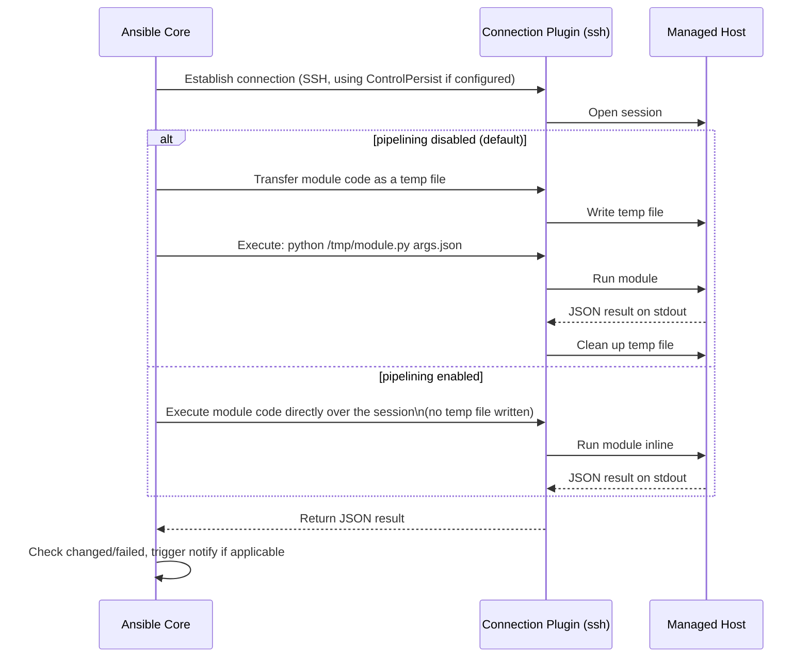

# Diagram 3: Module Execution / Connection Plugin Flow

Referenced from [`docs/ansible-architecture.md`](../docs/ansible-architecture.md#2-connection-plugins).

**Key points:**
- Pipelining (`ansible.cfg`'s `[ssh_connection] pipelining = True`) skips the temp-file write/cleanup round-trip — a real speed win, but requires `requiretty` disabled in sudoers on the target.
- `become` inserts a privilege-escalation step (`sudo`, etc.) between the connection being established and the module actually executing — a become failure is a distinct failure mode from a connection failure, diagnosed differently (see [`docs/troubleshooting.md`](../docs/troubleshooting.md)).
