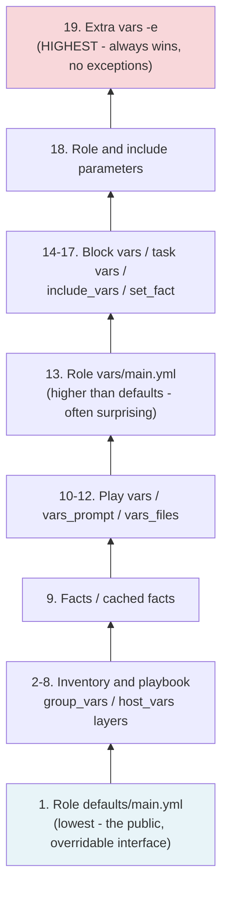

# Diagram 4: Variable Precedence Order

Referenced from [`docs/inventory-and-variables.md` §4](../docs/inventory-and-variables.md#4-variable-precedence-order).

**Key points:**
- Extra vars (`-e`) always win, which is exactly why an accidental or careless `-e` in a CI job can silently override a carefully-set environment-specific value with no warning.
- Role `defaults/` (lowest) vs. role `vars/` (much higher, step 13) is the single most common source of "why isn't my override taking effect" confusion — see [`docs/role-design.md` §1](../docs/role-design.md#1-standard-role-structure).
