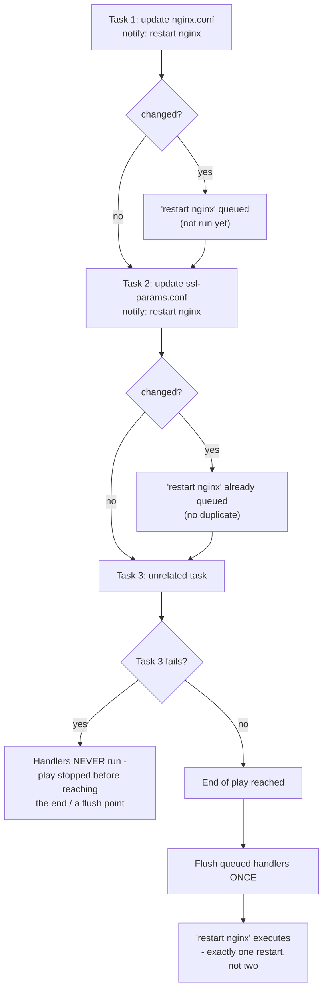

# Diagram 5: Handler Notification and Flush Flow

Referenced from [`docs/ansible-internals.md` §5](../docs/ansible-internals.md#5-handlers--deferred-execution-not-immediate).

**Key points:**
- Two tasks notifying the same handler still only trigger **one** execution of it, at flush time — not once per notifying task.
- If any task after the notifying ones fails before a flush point, **queued handlers never run at all** — a config file can be updated with the service never restarted to pick it up, a frequent, confusing incident (see [`docs/troubleshooting.md`](../docs/troubleshooting.md)).
