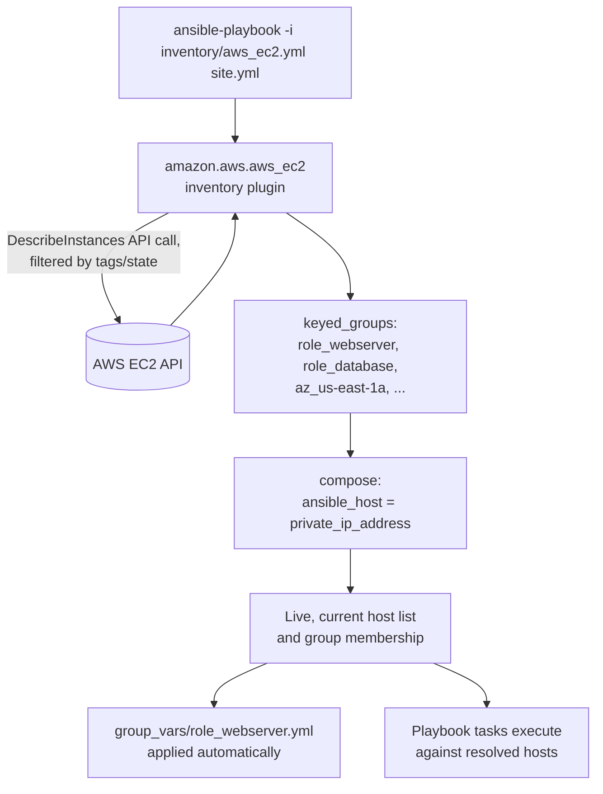

# Diagram 6: Dynamic Inventory Architecture (AWS)

Referenced from [`docs/inventory-and-variables.md` §1](../docs/inventory-and-variables.md#1-static-vs-dynamic-inventory) and [Lab 3](../labs/lab-03-dynamic-inventory/).

**Key points:**
- Inventory is resolved **live, every run** — never stale relative to what's actually running in AWS, unlike a hand-maintained static file.
- `keyed_groups` and `compose` let tag-based cloud metadata drive group membership and connection details automatically — no manual inventory maintenance as instances launch/terminate.
- A live API dependency means an AWS API outage or IAM permission gap makes the inventory unavailable entirely — a real, if usually minor, availability trade-off against a static file's independence from any live API call.
