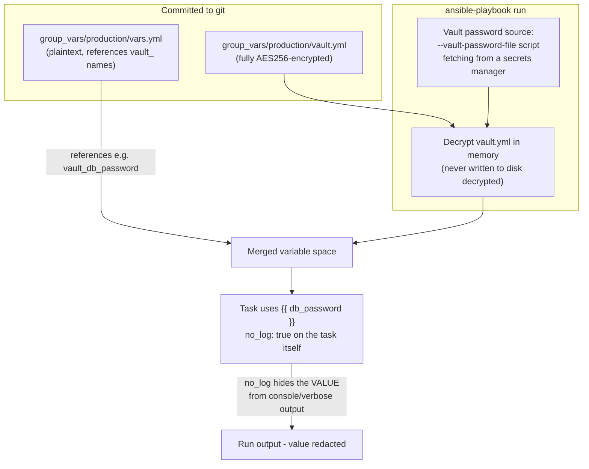

# Diagram 7: Ansible Vault Encrypt/Decrypt Flow

Referenced from [`docs/security.md`](../docs/security.md) and [Lab 4](../labs/lab-04-ansible-vault/).

**Key points:**
- The vars/vault split keeps `git diff` useful on the plaintext file (you can see *that* a variable is referenced) while the actual secret value stays encrypted at rest.
- The vault **password** itself is the real key-management problem — a production setup fetches it from a secrets manager at run time via a password script, never a plaintext file sitting on disk long-term.
- `no_log` on the consuming task is a **display** control (console/log redaction), not a storage control — the decrypted value still exists in memory during the run, and any *other*, non-`no_log`'d task referencing the same variable would still expose it.
