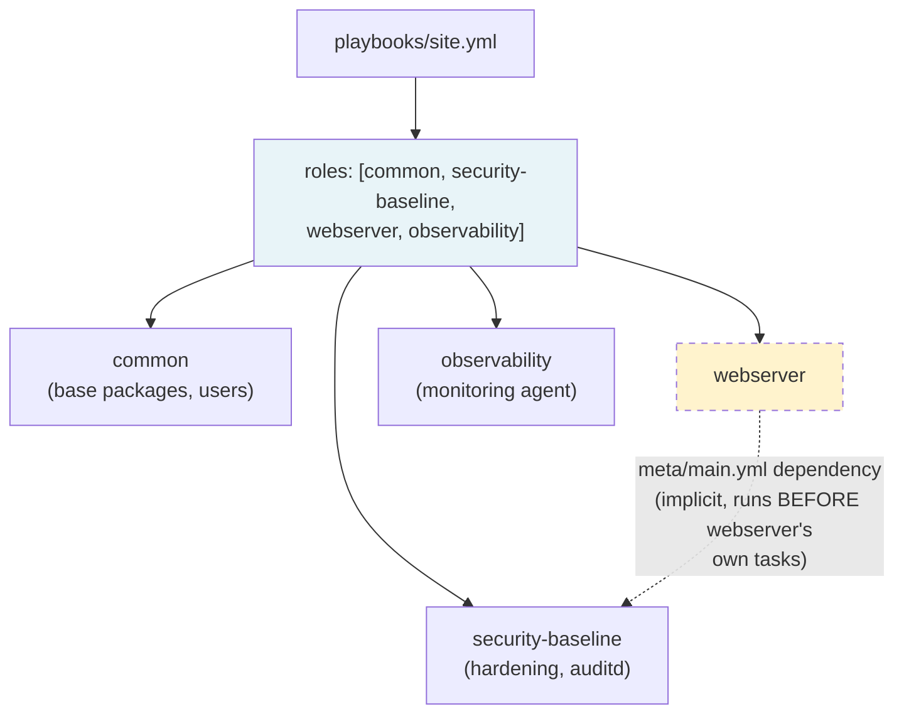

# Diagram 8: Role Dependency and Composition Architecture

Referenced from [`docs/role-design.md`](../docs/role-design.md) and [Lab 2](../labs/lab-02-roles-and-structure/).

**Key points:**
- The explicit `roles: [...]` list in the playbook is immediately legible to anyone reading it — every role that will run is visible in one place.
- The dashed edge (webserver's `meta/main.yml` dependency on `security-baseline`) is **invisible** from the playbook alone — a reader has to know to check `webserver/meta/main.yml` to discover it runs a second time (once explicitly, once implicitly) or realize the explicit listing is actually redundant with the implicit dependency.
- This is exactly the trade-off discussed in [`docs/role-design.md` §4](../docs/role-design.md#4-role-dependencies-metamainyml) — many mature codebases avoid `meta/main.yml` dependencies specifically to keep execution order fully visible in the playbook itself.
