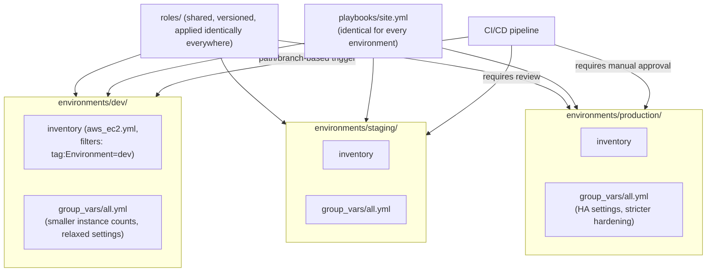

# Diagram 9: Multi-Environment Repository/Inventory Structure

Referenced from [Lab 5](../labs/lab-05-multi-environment/) and [`docs/inventory-and-variables.md` §2](../docs/inventory-and-variables.md#2-groups-group_vars-and-host_vars).

**Key points:**
- The **same playbook and roles** run against every environment — environment-specific behavior comes entirely from `group_vars`, never from `when:` branching inside the playbook itself.
- Each environment has its own inventory (dynamic, scoped by tag) and its own variable overrides — isolation comes from structurally separate inventories, not a shared inventory with an environment "switch."
- CI approval gates tighten by environment exactly as in the companion Terraform repository's pattern.
