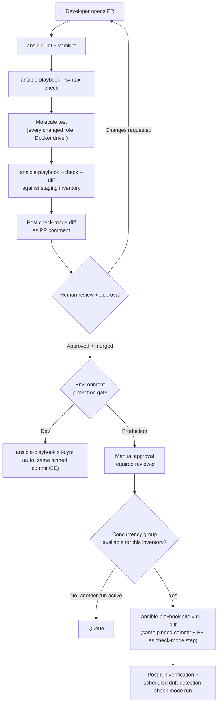

# Diagram 10: CI/CD Workflow for Ansible

Referenced from [`docs/cicd.md`](../docs/cicd.md) and [Lab 12](../labs/lab-12-cicd-pipeline/).

**Key points:**
- Ansible has no saved-plan-artifact equivalent — the pipeline's own discipline (pinning the exact commit and Execution Environment image between the check-mode review step and the real apply step) is what substitutes for that guarantee.
- Concurrency groups are scoped to the target inventory/environment, preventing two runs from racing against the same fleet — Ansible itself has no built-in per-inventory lock.
