# Diagram 11: Packer + Ansible Golden-AMI Pipeline

Referenced from [Lab 8](../labs/lab-08-packer-ami-baking/).

```mermaid
flowchart LR
    Trigger["Scheduled or PR-triggered\nbake pipeline"] --> PackerBuild["packer build golden-ami.pkr.hcl"]
    PackerBuild --> LaunchTemp["Launch temporary EC2 instance\nfrom base AMI"]
    LaunchTemp --> Connect["Connect via SSH or\nSSM Session Manager\n(no bastion, no open port 22)"]
    Connect --> AnsibleProvisioner["Ansible provisioner runs\nharden-and-configure.yml"]
    AnsibleProvisioner --> Roles["security-baseline, observability-agent\n(same roles used for fleet config mgmt)"]
    Roles --> Cleanup["post_tasks: remove SSH host keys,\nclear machine-id, truncate logs"]
    Cleanup --> Snapshot["Packer stops instance,\ncreates AMI snapshot"]
    Snapshot --> Terminate[Terminate temp instance]
    Terminate --> GoldenAMI["New golden AMI,\ntagged with a version"]
    GoldenAMI --> TFVar["Terraform ami_id variable\nbumped via a reviewed PR\n(pinned, not a live 'latest' lookup)"]
```

**Key points:**
- The **same** hardening roles used for ongoing fleet configuration management (via push automation) are reused here — one source of truth for "what does a hardened host look like," not a separately-maintained bake-time script.
- The resulting AMI ID is deliberately **pinned** into Terraform via a reviewed change, not resolved via a live "most recent AMI" data source lookup — connecting directly to the pinned-vs-live-lookup discussion in the companion Terraform repository.
