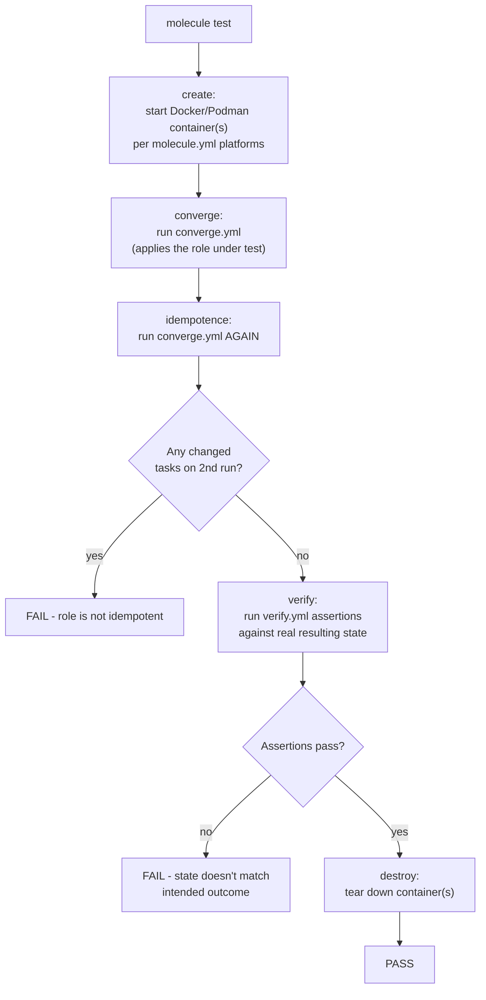

# Diagram 12: Molecule Testing Architecture

Referenced from [`docs/testing.md`](../docs/testing.md) and [Lab 11](../labs/lab-11-molecule-testing/).

**Key points:**
- The `idempotence` stage is Molecule's automated, enforced proof of the idempotency contract — not an assumption, a real test that fails the build if a second run reports any changes.
- `verify.yml` checks the **actual observable state** (a running service, correct config content) — passing `converge` alone only proves "Ansible didn't error," not "the intended outcome is true."
- Using Docker/Podman as the driver means this entire cycle is free and fast (seconds), suitable for every PR — real-cloud integration testing is a separate, costlier tier (see [`docs/testing.md` §6](../docs/testing.md#6-mocking-cloud-calls-for-fast-free-unit-level-testing)).
