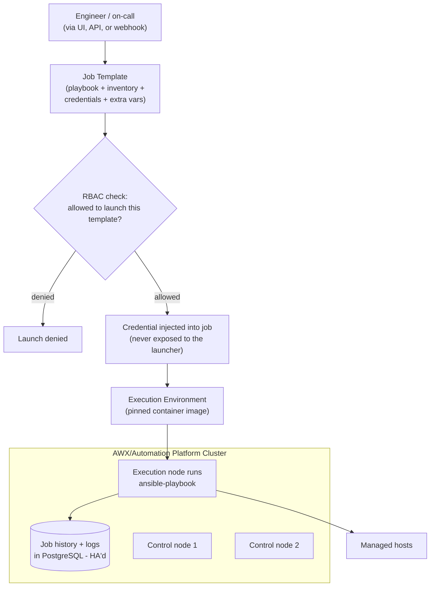

# Diagram 13: AWX / Ansible Automation Platform Architecture

Referenced from [`docs/ansible-architecture.md` §7](../docs/ansible-architecture.md#7-awx--ansible-automation-platform-architecture) and [`docs/ha-dr.md`](../docs/ha-dr.md).

**Key points:**
- Credentials are injected into a job's execution scope without ever being exposed to the person who launched it — access to *launch* a template using a credential is separate from access to *view* the credential's value.
- Every job runs inside a specific, pinned Execution Environment image — not whatever happens to be installed on a shared control node.
- The PostgreSQL backend (job history, credentials, inventory data) is the most critical piece to protect for HA — see [`docs/ha-dr.md` §1](../docs/ha-dr.md#1-control-plane-ha-awx--ansible-automation-platform).
