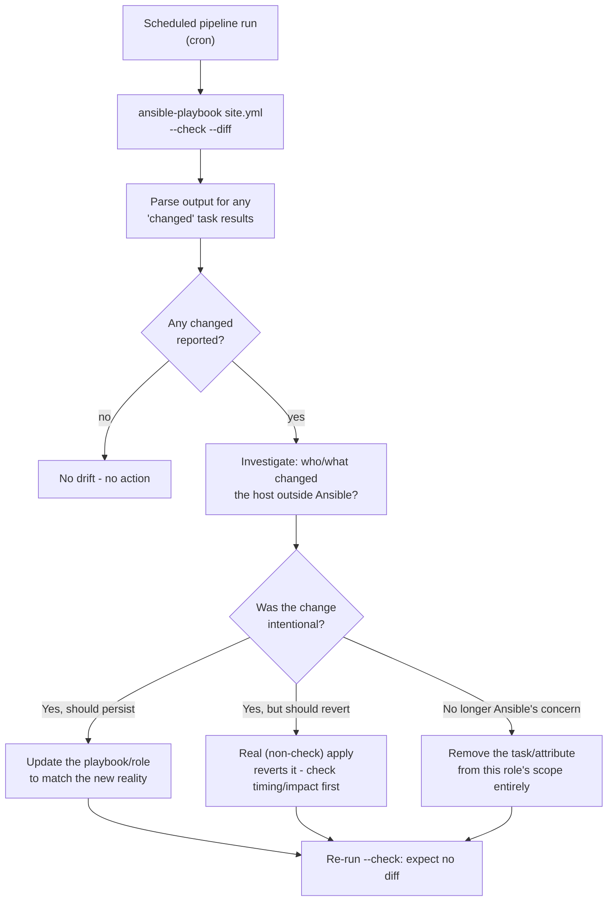

# Diagram 14: Drift Detection and Reconciliation

Referenced from [`docs/cicd.md` §6](../docs/cicd.md#6-drift-detection) and [Lab 14](../labs/lab-14-troubleshooting-and-recovery/).

**Key points:**
- This mirrors the Terraform drift decision framework exactly, adapted to Ansible: check-mode detects the divergence, but the *decision* (update the source of truth, revert, or deliberately exclude) still requires human judgment about intent.
- Because check mode's accuracy depends entirely on every task supporting it (see [`docs/ansible-internals.md` §4](../docs/ansible-internals.md#4-check-mode-and-diff-mode)), a fleet with unaudited `command`/`shell` tasks will under-report drift here — a real, distinct limitation from Terraform's plan accuracy.
