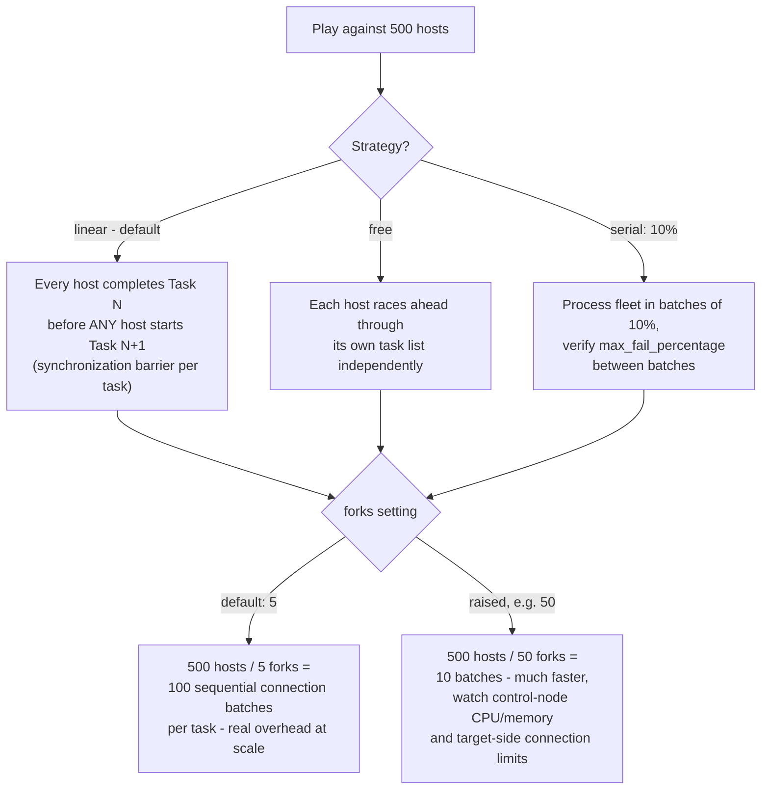

# Diagram 15: Fleet-Scale Execution Strategy

Referenced from [`docs/ansible-internals.md` §2](../docs/ansible-internals.md#2-execution-strategy-and-parallelism) and [`interview-questions/12-performance-scale.md`](../interview-questions/12-performance-scale.md).

**Key points:**
- `strategy` and `forks` are independent levers — `linear` with high `forks` still synchronizes after every task, just with more hosts processed concurrently within each task.
- `serial` with `max_fail_percentage` is the safety mechanism for large rollouts — a systemic bad change halts after a small percentage of the fleet fails, rather than grinding through everything before anyone notices.
- Profiling (the `ansible.posix.profile_tasks` callback) should come **before** tuning any of these — a small number of genuinely slow tasks (unnecessary fact-gathering, a control-node-side lookup plugin call per host) often dominates far more than raw host count or fork settings.
