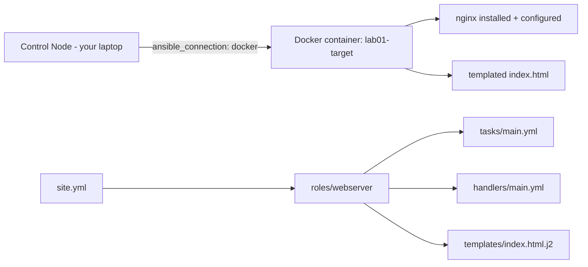

# Lab 1: Ansible Core Workflow

## Objective
Build a small but structurally complete Ansible project that exercises every core language and workflow concept — inventory, variables, facts, modules, handlers, conditionals, loops, and check mode — against a disposable local Docker container target, as a foundation for every later lab.

## Scenario
You're new to a team's Ansible codebase. Before touching any real fleet, you want a minimal, disposable sandbox to build muscle memory for the core workflow: how Ansible resolves inventory and variables, what idempotency actually looks like in practice, how handlers defer and flush, and how `--check --diff` previews a change. This lab is that sandbox — a single Docker container configured as a minimal web server, deliberately chosen so there is zero cloud cost and zero SSH-key setup friction.

## Skills Practised
- `ansible.cfg` and inventory basics (INI-format static inventory)
- Variable precedence basics (`group_vars`, role `defaults`, `-e`)
- Fact gathering and using `ansible_facts` in a template
- Core modules: `package`, `service`, `template`, `copy`, `file`, `lineinfile`
- Handlers: `notify`, deferred execution, and `meta: flush_handlers`
- `when` conditionals and `loop`
- `register` + `ansible.builtin.debug` for inspecting task results
- `--check --diff` (check mode) versus a real run
- Idempotency verification: running the same playbook twice with zero `changed` on the second run

## Architecture

Using the `community.docker` connection plugin instead of SSH removes all key-management setup — the "connection" is just `docker exec` under the hood, letting this lab focus purely on Ansible's own execution model.

## Prerequisites
- `ansible-core` >= 2.16 (`ansible --version`)
- `community.docker` collection: `ansible-galaxy collection install community.docker`
- Docker installed and running locally (`docker ps` succeeds), able to run a `--privileged` container (the `geerlingguy/docker-ubuntu2204-ansible` systemd-capable image used as the lab target)
- No prior lab dependency — this is the entry point of the whole repository

## Directory Structure
```text
lab-01-core-workflow/
├── README.md
├── ansible.cfg
├── inventory/
│   └── hosts.ini
├── group_vars/
│   └── all.yml
├── site.yml
└── roles/
    └── webserver/
        ├── defaults/main.yml
        ├── tasks/main.yml
        ├── handlers/main.yml
        └── templates/index.html.j2
```

## Step-by-Step Tasks
1. Start the target container using a systemd-capable image (needed for the `service`/`systemd` modules to work correctly — a plain `ubuntu:22.04` container has no init system as PID 1):
   ```bash
   docker run -d --name lab01-target --privileged \
     --cgroupns=host -v /sys/fs/cgroup:/sys/fs/cgroup:rw \
     geerlingguy/docker-ubuntu2204-ansible:latest
   ```
2. Review `inventory/hosts.ini` — note `ansible_connection=community.docker.docker` pointing at the container by name, not an IP.
3. Run `ansible all -i inventory/hosts.ini -m ansible.builtin.ping` and confirm connectivity.
4. Read `roles/webserver/tasks/main.yml` and `handlers/main.yml` — note which tasks `notify` the `restart nginx` handler and which don't.
5. Run `ansible-playbook site.yml --check --diff` and read the diff output carefully — nothing has actually changed on the container yet.
6. Run `ansible-playbook site.yml` for real and observe the `PLAY RECAP`.
7. Run `ansible-playbook site.yml` a second time immediately and confirm every task reports `ok`, none report `changed` — this is idempotency, proven, not assumed.
8. Inspect the rendered `/var/www/html/index.html` inside the container and confirm it reflects the templated facts.

## Ansible Configuration
See [`ansible.cfg`](ansible.cfg), [`inventory/hosts.ini`](inventory/hosts.ini), [`group_vars/all.yml`](group_vars/all.yml), [`site.yml`](site.yml), and [`roles/webserver/`](roles/webserver/) in this directory — all fully runnable as-is once the target container is running.

## Commands to Execute
```bash
docker run -d --name lab01-target --privileged \
  --cgroupns=host -v /sys/fs/cgroup:/sys/fs/cgroup:rw \
  geerlingguy/docker-ubuntu2204-ansible:latest
ansible-galaxy collection install community.docker
ansible all -i inventory/hosts.ini -m ansible.builtin.ping
ansible-playbook site.yml --check --diff
ansible-playbook site.yml
ansible-playbook site.yml   # run again - expect changed=0
docker exec lab01-target cat /var/www/html/index.html
```

## Expected Output
- The first `ansible-playbook site.yml` run reports several `changed` tasks (package install, template render, handler-triggered restart).
- The second, identical run reports `ok=N changed=0` for every task — proof of idempotency.
- `/var/www/html/index.html` inside the container shows the target's own hostname and OS family, populated from `ansible_facts`.

## Validation
```bash
# Confirm nginx is actually installed and running inside the container
docker exec lab01-target service nginx status

# Confirm the rendered file matches what the template intended
docker exec lab01-target grep -o "Managed by Ansible" /var/www/html/index.html

# Confirm the second run was genuinely a no-op
ansible-playbook site.yml | grep "changed=0"
```
All three checks should succeed — this is the "does the target's real, observed state match what the playbook declares" check that recurs throughout this repository.

## Failure Injection
Deliberately introduce a non-idempotent task to see what a `command`-without-a-guard failure looks like:
```yaml
# Temporarily add this task to roles/webserver/tasks/main.yml
- name: Non-idempotent test task
  ansible.builtin.command: touch /tmp/marker-{{ ansible_date_time.epoch }}
```
Run the playbook twice and observe this specific task reports `changed: true` on **every** run, never settling to `ok` — this is exactly Category 1's Question 1 ("the playbook that broke on the second run") reproduced hands-on. Remove the task afterward, or add a proper `creates:`/`changed_when` guard and observe the difference.

## Troubleshooting Exercise
1. Manually edit `/var/www/html/index.html` inside the container directly (`docker exec -it lab01-target bash`, then edit the file).
2. Run `ansible-playbook site.yml --check --diff` and observe it detects the drift and shows exactly what would be reverted.
3. This is your first hands-on encounter with Ansible's own drift-detection-via-check-mode — read [`docs/ansible-internals.md`](../../docs/ansible-internals.md) §3 for the full check-mode discussion (including its blind spot for `command`/`shell` tasks) before deciding whether to let the real run revert it.

## Cleanup
```bash
docker rm -f lab01-target
```
**Chargeable resources:** none — this lab runs entirely against a local Docker container with no cloud dependency. Always run cleanup when finished regardless, as good practice.

## Interview Questions Connected to This Lab
- [Question 1: The playbook that broke on the second run](../../interview-questions/01-ansible-core.md#question-1-the-playbook-that-broke-on-the-second-run) — idempotency as a contract
- [Question 2: The restart that never happened](../../interview-questions/01-ansible-core.md#question-2-the-restart-that-never-happened) — handler flush timing
- [Question 7: The check-mode run that lied](../../interview-questions/01-ansible-core.md#question-7-the-check-mode-run-that-lied) — check mode's command/shell blindness

## Production Considerations
- Real production inventories are dynamic (see [Lab 3](../lab-03-dynamic-inventory/)), not a static `hosts.ini` with a hardcoded container name.
- This lab intentionally uses the Docker connection plugin to avoid SSH-key setup — see [Lab 7](../lab-07-aws-configuration-management/) for real, SSH-based fleet configuration against actual EC2 instances.
- Handlers here are simple and single-purpose — see [`docs/ansible-internals.md`](../../docs/ansible-internals.md) §5 for the deferred-execution trap this simplicity hides.

## Advanced Challenge
Extend the role to accept a `webserver_port` variable (default `80`), templating it into both the nginx config and a firewall-adjacent `ufw allow` task guarded by a `when: webserver_port != 80` conditional avoiding a redundant rule for the default port. Confirm via `--check --diff` that changing `webserver_port` via `-e webserver_port=8080` correctly previews both the config-file change and the newly-triggered firewall task, and that the default run (no `-e`) correctly skips the firewall task entirely.
