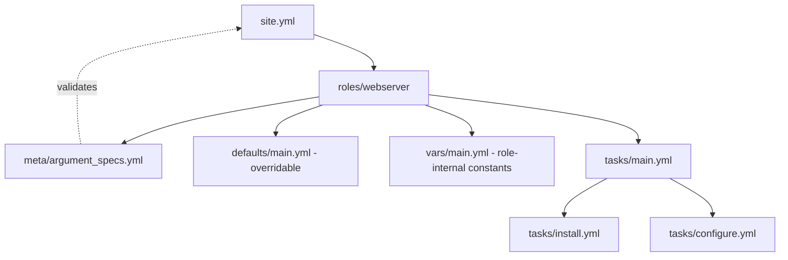

# Lab 2: Roles and Structure

## Objective
Refactor Lab 1's flat playbook into a proper, reusable role with `argument_specs.yml`, `defaults` vs `vars` correctly separated, and a `meta/main.yml` — the foundation every later lab's role structure builds on.

## Scenario
Lab 1's `webserver` role works but has no documented, validated interface — anyone using it has to read the task file to know what variables exist or what values are legal. You've been asked to harden it into a role other teams can safely consume without reading its internals, exactly the problem `argument_specs.yml` (Ansible's closest equivalent to Terraform's typed/validated module variables) solves.

## Skills Practised
- Standard role directory structure (`defaults`, `vars`, `tasks`, `handlers`, `templates`, `meta`)
- `argument_specs.yml` — typed, validated role inputs with required/optional fields and choices
- The `defaults` vs `vars` precedence distinction as a real interface decision
- `meta/main.yml` role metadata and (empty) dependency declaration
- Splitting a monolithic `tasks/main.yml` into `include_tasks`-referenced sub-files
- Role documentation via `README.md` conventions

## Architecture


## Prerequisites
- Completion of [Lab 1](../lab-01-core-workflow/) (same target-container approach)
- `ansible-core` >= 2.16 (argument_specs validation requires >= 2.11)

## Directory Structure
```text
lab-02-roles-and-structure/
├── README.md
├── ansible.cfg
├── inventory/hosts.ini
├── site.yml
└── roles/
    └── webserver/
        ├── meta/main.yml
        ├── meta/argument_specs.yml
        ├── defaults/main.yml
        ├── vars/main.yml
        ├── tasks/main.yml
        ├── tasks/install.yml
        ├── tasks/configure.yml
        ├── handlers/main.yml
        └── templates/index.html.j2
```

## Step-by-Step Tasks
1. Compare `defaults/main.yml` (user-overridable: `webserver_port`) against `vars/main.yml` (role-internal, higher-precedence: `webserver_package_name` mapping per OS family) — read [`docs/role-design.md`](../../docs/role-design.md) §1 for why this split matters.
2. Review `meta/argument_specs.yml` and note the `required`, `type`, and `choices` constraints on `webserver_port`.
3. Deliberately call the role with an invalid input: `ansible-playbook site.yml -e webserver_port=not-a-number` and observe Ansible reject it **before** any task runs, citing the argument_specs validation failure.
4. Run the playbook normally and confirm it still produces the same result as Lab 1.
5. Read `tasks/main.yml` and note it now only orchestrates `include_tasks` calls to `install.yml`/`configure.yml` — a pattern that scales far better than one large file as a role grows.

## Ansible Configuration
See [`roles/webserver/`](roles/webserver/) in this directory.

## Commands to Execute
```bash
docker run -d --name lab02-target --privileged \
  --cgroupns=host -v /sys/fs/cgroup:/sys/fs/cgroup:rw \
  geerlingguy/docker-ubuntu2204-ansible:latest
ansible-playbook site.yml -e webserver_port=not-a-number   # expect a validation error, no tasks run
ansible-playbook site.yml                                    # succeeds
ansible-playbook site.yml -e webserver_port=8080              # succeeds, different port
```

## Expected Output
- The invalid-input run fails immediately with an `argument_specs` validation error naming `webserver_port` and the expected type — no task in the role executes.
- Valid runs succeed identically to Lab 1, just now through a validated, documented interface.

## Validation
```bash
docker exec lab02-target cat /etc/nginx/sites-available/default | grep listen
```
Confirms the actually-deployed port matches whatever was passed via `-e`, proving the validated variable genuinely reaches the rendered configuration.

## Failure Injection
Add a second variable to `vars/main.yml` with the *same name* as one already in `defaults/main.yml` (e.g., `webserver_port: 9999` in `vars/main.yml`). Run the playbook and observe `vars/main.yml`'s value wins regardless of what's passed via inventory `group_vars` — but note that `-e` (extra-vars) *still* wins over both. This is Category 3's Question 12 ("the role that couldn't be overridden") reproduced hands-on — remove the conflicting `vars/main.yml` entry afterward.

## Troubleshooting Exercise
Delete `meta/argument_specs.yml` entirely, then re-run the invalid-input command from Step 3. Observe the role now happily accepts `webserver_port=not-a-number` and fails much later, deep inside the `template` task, with a confusing Jinja2 type error instead of an immediate, clear validation message — demonstrating exactly why `argument_specs.yml` matters for catching bad input early, at the interface boundary, not deep inside implementation.

## Cleanup
```bash
docker rm -f lab02-target
```
**Chargeable resources:** none.

## Interview Questions Connected to This Lab
- [Question 12: The role that couldn't be overridden](../../interview-questions/02-inventory-variables.md#question-12-the-role-that-couldnt-be-overridden) — defaults vs vars precedence
- [Question 26: The README that lied](../../interview-questions/03-roles-collections.md#question-26-the-readme-that-lied) — argument_specs as source of truth
- [Question 27: The role that only told you the port](../../interview-questions/03-roles-collections.md#question-27-the-role-that-only-told-you-the-port) — role output design

## Production Considerations
- A production role would also include `molecule/` tests (see [Lab 11](../lab-11-molecule-testing/)) validating this exact `argument_specs` contract automatically in CI, not just manually as in this lab.
- Real roles serving many consumers need the deprecation-aliasing discipline from [Question 23](../../interview-questions/03-roles-collections.md#question-23-the-role-update-that-broke-thirty-playbooks) before renaming any variable.

## Advanced Challenge
Add a second role, `roles/tls_termination`, with its own `argument_specs.yml` requiring a `tls_cert_path` and `tls_key_path`, and a `meta/main.yml` dependency on `webserver` (so `tls_termination` always pulls in `webserver` first). Confirm role dependency ordering via `ansible-playbook site.yml --list-tasks` shows `webserver`'s tasks before `tls_termination`'s.
