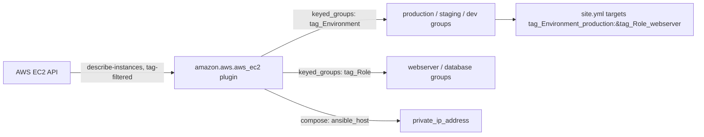

# Lab 3: Dynamic Inventory

## Objective
Replace a static inventory file with the `amazon.aws.aws_ec2` dynamic inventory plugin, using tag-based `keyed_groups` and `compose` to build inventory automatically from live AWS state.

## Scenario
Your team currently maintains a hand-edited `hosts.ini` that's perpetually out of date the moment anyone launches or terminates an EC2 instance. You've been asked to replace it with dynamic inventory driven entirely by instance tags, so the inventory is always an accurate, live reflection of what's actually running — never a stale, manually-maintained guess.

## Skills Practised
- The `amazon.aws.aws_ec2` inventory plugin
- `keyed_groups` — deriving inventory groups automatically from tag values
- `compose` — deriving `ansible_host` and custom variables from instance attributes
- `filters` — scoping which instances are even considered
- `ansible-inventory --graph` / `--list` for inspecting resolved inventory
- IRSA-equivalent least-privilege IAM for the automation identity querying EC2

## Architecture


## Prerequisites
- An AWS account with 2-3 EC2 instances tagged `Environment` and `Role` (or use the provided Terraform snippet in [`terraform-fixtures/`](terraform-fixtures/) to launch minimal `t3.micro` test instances)
- IAM permissions: `ec2:DescribeInstances`, `ec2:DescribeTags`
- `amazon.aws` collection: `ansible-galaxy collection install amazon.aws`
- `boto3`/`botocore` Python packages on the control node

## Directory Structure
```text
lab-03-dynamic-inventory/
├── README.md
├── ansible.cfg
├── inventory/
│   └── aws_ec2.yml
├── terraform-fixtures/
│   └── main.tf
└── site.yml
```

## Step-by-Step Tasks
1. Review `terraform-fixtures/main.tf` — a minimal, cheap (`t3.micro`) set of 3 tagged instances for this lab (or point at instances you already have tagged appropriately).
2. Apply the fixture: `cd terraform-fixtures && terraform apply` (see its own cost warning below).
3. Review `inventory/aws_ec2.yml` — note the `filters`, `keyed_groups`, and `compose` sections.
4. Run `ansible-inventory -i inventory/aws_ec2.yml --graph` and confirm instances are correctly grouped by `tag_Environment_*` and `tag_Role_*`.
5. Run `ansible-inventory -i inventory/aws_ec2.yml --list` and inspect the full resolved variable set for one host.
6. Run `ansible-playbook site.yml -i inventory/aws_ec2.yml --limit tag_Role_webserver` and confirm only the correctly-tagged subset is targeted.

## Ansible Configuration
See [`inventory/aws_ec2.yml`](inventory/aws_ec2.yml) and [`site.yml`](site.yml).

## Commands to Execute
```bash
ansible-galaxy collection install amazon.aws
cd terraform-fixtures && terraform init && terraform apply && cd ..
ansible-inventory -i inventory/aws_ec2.yml --graph
ansible-inventory -i inventory/aws_ec2.yml --list | jq '._meta.hostvars'
ansible-playbook site.yml -i inventory/aws_ec2.yml --limit tag_Role_webserver -m ping
```

## Expected Output
- `--graph` shows a tree with `@tag_Environment_dev`, `@tag_Role_webserver`, etc., each containing the correctly-tagged instances.
- `ansible_host` for each instance resolves to its private IP (via `compose`), not requiring any manual IP entry anywhere.

## Validation
```bash
# Confirm every EC2 instance with the Role=webserver tag actually appears
aws ec2 describe-instances --filters "Name=tag:Role,Values=webserver" "Name=instance-state-name,Values=running" \
  --query 'Reservations[].Instances[].InstanceId' --output text
ansible-inventory -i inventory/aws_ec2.yml --list | jq -r '.tag_Role_webserver.hosts[]'
```
Both commands should return the same set of instance IDs — proving the dynamic inventory's tag-based resolution matches AWS's own ground truth.

## Failure Injection
Launch a new test instance via the Terraform fixture but forget to apply the `Role` tag (comment it out in `terraform-fixtures/main.tf` for one instance, `terraform apply`). Re-run `ansible-inventory --graph` and observe the untagged instance appears under no `tag_Role_*` group at all — reproducing Category 5's Question 52 (the tag that decided everything) hands-on. This instance would be silently invisible to any `--limit tag_Role_*`-scoped playbook run, including security patching.

## Troubleshooting Exercise
Set an overly narrow `filters` entry (e.g., `tag:Environment: production` when your fixture instances are tagged `dev`) and re-run `--graph`. Observe the inventory resolves to **zero hosts**, with no error — reproducing Category 2's Question 11 (the play that matched zero hosts). Add an `assert` pre-task to `site.yml` guarding against exactly this (see the file for the guard already included, commented out — uncomment it and re-test).

## Cleanup
```bash
cd terraform-fixtures && terraform destroy
```
**Chargeable resources:** 3× `t3.micro` EC2 instances (a few cents/hour if left running) — destroy promptly after the lab.

## Interview Questions Connected to This Lab
- [Question 11: The play that matched zero hosts](../../interview-questions/02-inventory-variables.md#question-11-the-play-that-matched-zero-hosts)
- [Question 15: Two inventories, one confused host](../../interview-questions/02-inventory-variables.md#question-15-two-inventories-one-confused-host)
- [Question 49: The inventory query that got throttled](../../interview-questions/05-aws-cloud-integration.md#question-49-the-inventory-query-that-got-throttled)
- [Question 52: The tag that decided everything](../../interview-questions/05-aws-cloud-integration.md#question-52-the-tag-that-decided-everything)

## Production Considerations
- Real fleets at scale need inventory caching (`cache: true`) per Question 49 — this lab's small fixture doesn't demonstrate throttling, but the config includes caching commented in for reference.
- Production tag-based automation needs the prevention-plus-detection layered defense from Question 52 (an SCP requiring tags at launch, plus a periodic untagged-instance sweep) — this lab only demonstrates the detection side.

## Advanced Challenge
Add a second inventory source (a static `inventory/legacy.ini` representing a not-yet-migrated host) and configure `ansible.cfg`'s `inventory` setting to reference both `inventory/aws_ec2.yml` and `inventory/legacy.ini` as a directory-based composite inventory. Confirm `ansible-inventory --graph` correctly merges both sources, and investigate what happens if the same hostname appears in both (reproducing Question 15's scenario).
