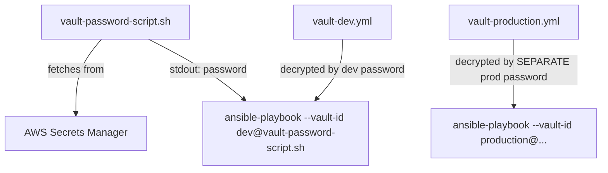

# Lab 4: Ansible Vault

## Objective
Encrypt sensitive variables with Ansible Vault, source the vault password dynamically from a script (never a committed plaintext file), and split vault content per-environment for least-privilege access.

## Scenario
A previous engineer committed a plaintext `vault_pass.txt` to the repository "since it's private." You've been asked to fix this properly: source the vault password from a script, split one monolithic vault file into per-environment files, and verify the fix actually closes the exposure — not just relocates it.

## Skills Practised
- `ansible-vault encrypt` / `encrypt_string` / `view` / `edit` / `rekey`
- Vault password scripts (`vault_password_file` pointing at an executable, not a static file)
- Multiple simultaneous vaults via `--vault-id`
- `no_log: true` and its actual, limited scope (doesn't cover every module error path)
- `--check --diff` interaction with vault-encrypted templated values

## Architecture


## Prerequisites
- Completion of [Lab 1](../lab-01-core-workflow/)
- AWS Secrets Manager access (or substitute a local, gitignored file for this lab if no AWS account is available — see the script's fallback branch)
- `ansible-core` >= 2.16

## Directory Structure
```text
lab-04-ansible-vault/
├── README.md
├── ansible.cfg
├── inventory/hosts.ini
├── scripts/
│   ├── vault-password-dev.sh
│   └── vault-password-production.sh
├── group_vars/
│   ├── dev/vault.yml        (encrypted, vault-id: dev)
│   └── production/vault.yml (encrypted, vault-id: production)
└── site.yml
```

## Step-by-Step Tasks
1. Set a local secret for the lab (simulating Secrets Manager): `export LAB_VAULT_PW_DEV=dev-secret-123 LAB_VAULT_PW_PROD=prod-secret-456`.
2. Review `scripts/vault-password-dev.sh` — note it reads from the environment variable, never a committed file.
3. Create the dev vault file: `ansible-vault create --vault-id dev@scripts/vault-password-dev.sh group_vars/dev/vault.yml` and add `db_password: dev-only-value`.
4. Repeat for production with its own, separate script/password.
5. Run `ansible-playbook site.yml --vault-id dev@scripts/vault-password-dev.sh -e target_env=dev` and confirm it decrypts and uses only the dev secret.
6. Attempt to run against production using only the dev vault-id password and confirm it fails to decrypt — proving the split actually enforces least privilege.

## Ansible Configuration
See [`scripts/`](scripts/), [`group_vars/`](group_vars/), and [`site.yml`](site.yml).

## Commands to Execute
```bash
export LAB_VAULT_PW_DEV=dev-secret-123
export LAB_VAULT_PW_PROD=prod-secret-456
chmod +x scripts/*.sh
ansible-vault create --vault-id dev@scripts/vault-password-dev.sh group_vars/dev/vault.yml
ansible-vault create --vault-id production@scripts/vault-password-production.sh group_vars/production/vault.yml
ansible-playbook site.yml --vault-id dev@scripts/vault-password-dev.sh -e target_env=dev --check --diff
```

## Expected Output
- `--check --diff` for the dev run shows the intended config file content, including the decrypted `db_password` value in plaintext in the diff (see Failure Injection below — this is expected but worth seeing directly).
- A run against `target_env=production` using only the dev vault-id password fails with a vault decryption error, never reaching any task.

## Validation
```bash
# Confirm the vault file is genuinely encrypted at rest (not plaintext)
head -1 group_vars/production/vault.yml   # should show $ANSIBLE_VAULT;1.1;AES256
```

## Failure Injection
Run the dev playbook with `--check --diff` and note the rendered config's diff shows the vault-decrypted `db_password` value in plaintext in your terminal output — reproducing Category 7's Question 64 (the vault-encrypted variable still visible in plan output). Add `no_log: true` to the templating task and re-run — confirm the diff output is now suppressed.

## Troubleshooting Exercise
Delete `scripts/vault-password-dev.sh` and instead hardcode the password directly in `ansible.cfg`'s `vault_password_file` pointing at a plaintext file containing the password. Run `git status` and observe this plaintext file would be tracked if not gitignored — reproducing Category 7's Question 61 (the vault password that was itself the vulnerability). Confirm `.gitignore` in this repository already excludes `vault_pass.txt`/`vault-password.txt` patterns, and restore the script-based approach.

## Cleanup
No cloud resources created in this lab (unless you wired the script to real Secrets Manager, in which case delete the test secrets: `aws secretsmanager delete-secret --secret-id lab04/vault-password-dev --force-delete-without-recovery`).

## Interview Questions Connected to This Lab
- [Question 61: The vault password that was itself the vulnerability](../../interview-questions/07-security-vault.md#question-61-the-vault-password-that-was-itself-the-vulnerability)
- [Question 63: Vault-per-environment or vault-per-secret?](../../interview-questions/07-security-vault.md#question-63-vault-per-environment-or-vault-per-secret)
- [Question 64: The vault-encrypted variable that was still visible in plan output](../../interview-questions/07-security-vault.md#question-64-the-vault-encrypted-variable-that-was-still-visible-in-plan-output)

## Production Considerations
- Real production vault-password scripts fetch from AWS Secrets Manager (or HashiCorp Vault, per Question 65) via IAM/IRSA-scoped access, never an environment variable set manually as in this simplified lab.
- Production secret-scanning (`gitleaks` in CI, per Question 66) should catch any accidental plaintext-secret commit before it ever merges.

## Advanced Challenge
Wire `scripts/vault-password-dev.sh` to genuinely fetch from AWS Secrets Manager (`aws secretsmanager get-secret-value`) instead of an environment variable, and add an IAM policy scoped to only `secretsmanager:GetSecretValue` on that one specific secret ARN — confirming least-privilege access for the vault-password-fetching identity itself.
