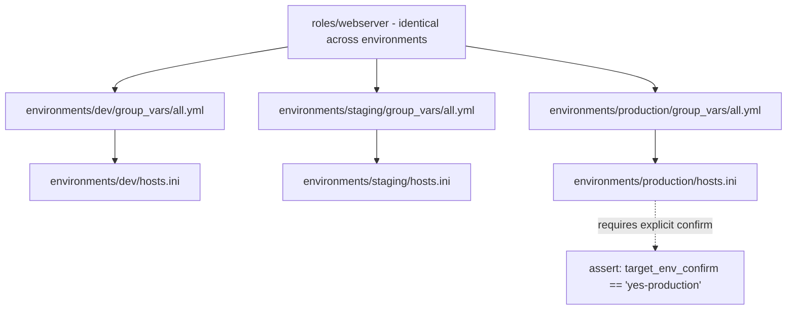

# Lab 5: Multi-Environment Architecture

## Objective
Structure a single playbook/role library to serve dev, staging, and production environments cleanly via per-environment inventories and `group_vars`, without duplicating playbook logic per environment.

## Scenario
Your organization has one application deployed identically (in shape) across three environments, differing only in scale (replica-equivalent counts), specific configuration values, and criticality. You've been asked to design the directory structure and variable layering so a single `site.yml` correctly serves all three, with production properly isolated from casual, accidental targeting.

## Skills Practised
- `environments/{dev,staging,production}/` inventory-per-environment structure
- `group_vars` layering: environment-specific values overriding role defaults
- `--limit` and explicit environment targeting (never an ambient/assumed default)
- A pre-flight `assert` guard requiring explicit `-e target_env=` confirmation for production
- Structuring shared roles so environment differences live in inventory/vars, not in the role itself

## Architecture


## Prerequisites
- Completion of [Lab 2](../lab-02-roles-and-structure/) (reuses the `webserver` role)
- Three target containers (or reuse one, run sequentially) — see Commands below

## Directory Structure
```text
lab-05-multi-environment/
├── README.md
├── ansible.cfg
├── environments/
│   ├── dev/
│   │   ├── hosts.ini
│   │   └── group_vars/all.yml
│   ├── staging/
│   │   ├── hosts.ini
│   │   └── group_vars/all.yml
│   └── production/
│       ├── hosts.ini
│       └── group_vars/all.yml
├── roles/webserver/            (identical to Lab 2)
└── site.yml
```

## Step-by-Step Tasks
1. Compare `environments/dev/group_vars/all.yml` against `environments/production/group_vars/all.yml` — note only *values* differ (`webserver_port`, a `criticality` tag), never role logic.
2. Run `ansible-playbook site.yml -i environments/dev/hosts.ini` and confirm it succeeds without any extra confirmation.
3. Run the identical command against `environments/production/hosts.ini` **without** the required `-e` flag and confirm the pre-flight `assert` blocks it immediately.
4. Re-run with the required confirmation: `ansible-playbook site.yml -i environments/production/hosts.ini -e target_env_confirm=yes-production`.
5. Confirm via `ansible-inventory -i environments/production/hosts.ini --graph` that production's inventory is entirely separate from dev/staging's — no accidental overlap.

## Ansible Configuration
See [`environments/`](environments/) and [`site.yml`](site.yml).

## Commands to Execute
```bash
for env in dev staging production; do
  docker run -d --name "lab05-${env}" --privileged \
    --cgroupns=host -v /sys/fs/cgroup:/sys/fs/cgroup:rw \
    geerlingguy/docker-ubuntu2204-ansible:latest
done
ansible-playbook site.yml -i environments/dev/hosts.ini
ansible-playbook site.yml -i environments/production/hosts.ini   # expect: blocked by assert
ansible-playbook site.yml -i environments/production/hosts.ini -e target_env_confirm=yes-production
```

## Expected Output
- Dev/staging runs succeed immediately with no extra confirmation required.
- The unconfirmed production run fails at the pre-flight `assert` task, before any configuration task runs.
- The confirmed production run succeeds and uses production's own `group_vars` values (e.g., a different `webserver_port`).

## Validation
```bash
docker exec lab05-production grep listen /etc/nginx/sites-available/default
docker exec lab05-dev grep listen /etc/nginx/sites-available/default
```
Confirms each environment's container reflects its own, correctly-isolated configuration values.

## Failure Injection
Temporarily copy `environments/production/group_vars/all.yml`'s content into `environments/dev/group_vars/all.yml` (simulating a copy-paste mistake). Run the dev playbook and observe it now uses production-intended values against the dev target — a low-stakes reproduction of what an actual environment-config mix-up would look like. Revert afterward.

## Troubleshooting Exercise
Delete the `assert` guard from `site.yml` entirely and re-run the production playbook without `-e target_env_confirm`. Observe it proceeds immediately with no confirmation step at all — reproducing exactly the risk the guard exists to prevent. Restore the guard.

## Cleanup
```bash
docker rm -f lab05-dev lab05-staging lab05-production
```
**Chargeable resources:** none (local Docker only).

## Interview Questions Connected to This Lab
- [Question 16: The -e that nobody remembered setting](../../interview-questions/02-inventory-variables.md#question-16-the--e-that-nobody-remembered-setting)
- [Question 18: The inventory that grew too large to plan around](../../interview-questions/02-inventory-variables.md#question-18-the-inventory-that-grew-too-large-to-plan-around)
- [Question 94: The migration from static to dynamic that broke silently](../../interview-questions/02-inventory-variables.md#question-20-the-migration-from-static-to-dynamic-that-broke-silently)

## Production Considerations
- Real production environments should combine this static-per-environment pattern with [Lab 3](../lab-03-dynamic-inventory/)'s dynamic inventory — most organizations use dynamic inventory *within* each environment's own AWS account/region, not a hand-maintained `hosts.ini`.
- The `assert`-based production guard here is a simple version of the AWX Survey/Workflow-approval-node pattern from [Lab 12](../lab-12-cicd-pipeline/) — a real platform would use AWX's own approval gate, not a bare `-e` flag anyone could type.

## Advanced Challenge
Add a fourth environment, `dr` (disaster recovery), whose `group_vars/all.yml` is required to be identical to `production`'s except for a region-specific value — write a small verification playbook (or a `diff`-based script) confirming `dr` and `production`'s `group_vars` never silently diverge, directly addressing Category 11's Question 99 (the DR region Ansible forgot existed).
