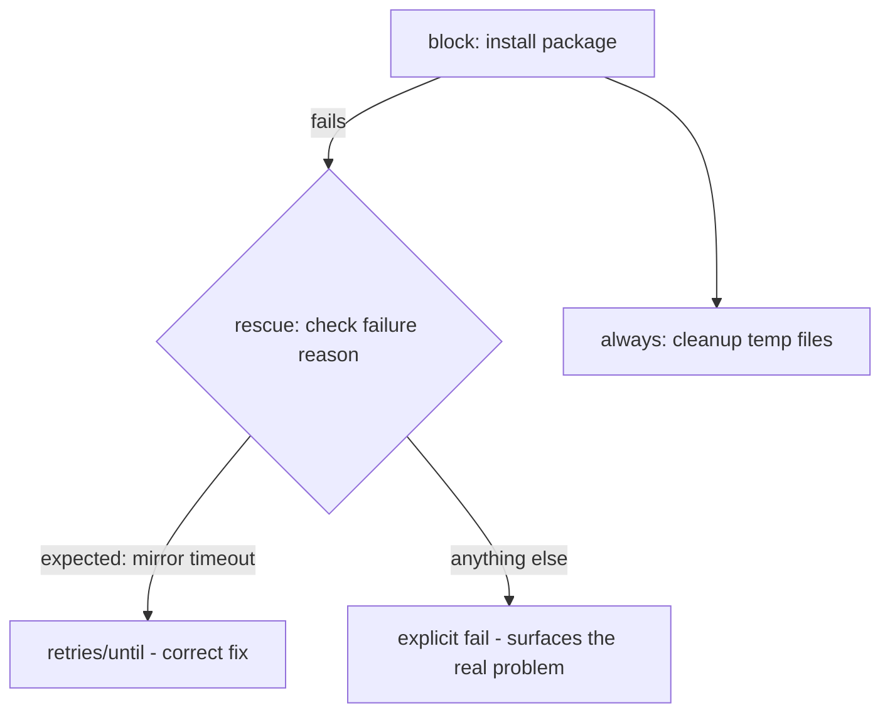

# Lab 6: Error Handling and Safe Refactoring

## Objective
Practice `block`/`rescue`/`always` error handling correctly — including the trap where a completing `rescue` reports overall success even if the underlying failure was serious — and safely refactor a risky task using `--check` first.

## Scenario
A deployment task occasionally fails due to a transient, retryable condition (a package mirror timeout) but is currently wrapped in a `rescue` block that silently continues past *any* failure, including genuinely serious ones. You've been asked to fix the rescue to distinguish the specific, expected failure from anything else, and to add a safe, previewed refactor process for future risky changes.

## Skills Practised
- `block` / `rescue` / `always` semantics
- The "rescue completing = success" trap and its fix via explicit `ansible.builtin.fail`
- `ansible_failed_result` for inspecting the actual failure reason inside `rescue`
- `retries` / `until` for genuinely transient conditions (the correct fix, not a blanket rescue)
- `--check --diff` as a pre-refactor safety net

## Architecture


## Prerequisites
- Completion of [Lab 1](../lab-01-core-workflow/)

## Directory Structure
```text
lab-06-error-handling-and-refactoring/
├── README.md
├── ansible.cfg
├── inventory/hosts.ini
└── site.yml
```

## Step-by-Step Tasks
1. Review `site.yml`'s first play, `broken_rescue` — a `block`/`rescue` that catches *any* failure and silently continues.
2. Run it against a deliberately-failing task (simulated via `ansible.builtin.fail` with a "disk full"-style message) and observe the play reports overall success despite the serious failure being swallowed.
3. Review the second play, `fixed_rescue` — the same structure, but the `rescue` now inspects `ansible_failed_result.msg` and only continues gracefully for the one specific, expected failure string, re-raising everything else via `ansible.builtin.fail`.
4. Re-run and confirm the same serious, unexpected failure is now correctly surfaced as a play failure, not silently swallowed.
5. Review the third play, `safe_refactor` — demonstrating `--check --diff` as the required first step before applying a risky change for real.

## Ansible Configuration
See [`site.yml`](site.yml).

## Commands to Execute
This lab runs entirely against `localhost` (no target container needed — it's purely demonstrating `block`/`rescue` control flow, not real system state):
```bash
ansible-playbook site.yml --tags broken_rescue
ansible-playbook site.yml --tags fixed_rescue
ansible-playbook site.yml --tags safe_refactor --check --diff
ansible-playbook site.yml --tags safe_refactor
```

## Expected Output
- `broken_rescue` reports `PLAY RECAP ... ok=N changed=N failed=0` — deceptively "clean," despite a genuinely serious failure having occurred and been silently swallowed.
- `fixed_rescue` reports a genuine task failure, correctly surfacing the same serious condition.
- `safe_refactor --check --diff` shows exactly what would change before anything is actually applied.

## Validation
```bash
ansible-playbook site.yml --tags broken_rescue | grep -c "failed=0"
ansible-playbook site.yml --tags fixed_rescue 2>&1 | grep -c "FAILED"
```
The first should show the play reporting no failures (the bug); the second should show a genuine `FAILED!` message (the fix).

## Failure Injection
This entire lab *is* the failure-injection exercise for `block`/`rescue` — see Step 2 above. Additionally, try changing the "expected" failure string in `fixed_rescue`'s rescue condition to no longer match the simulated failure, and confirm the fix now (correctly) surfaces even the originally-"expected" case as a failure too, demonstrating how precisely the match condition needs to be tuned.

## Troubleshooting Exercise
Add a third, entirely different simulated failure reason (e.g., "authentication failed") to the task inside `fixed_rescue`'s block, and confirm the rescue's specific-string match correctly distinguishes it from the one truly-expected, retryable failure — proving the fix generalizes, not just for the one originally-observed case.

## Cleanup
```bash
rm -f /tmp/lab06-refactor-target.txt
```
**Chargeable resources:** none — this lab runs entirely against localhost.

## Interview Questions Connected to This Lab
- [Question 6: The block that recovered silently](../../interview-questions/01-ansible-core.md#question-6-the-block-that-recovered-silently)
- [Question 93: The rescue block that rescued the wrong thing](../../interview-questions/10-troubleshooting.md#question-93-the-rescue-block-that-rescued-the-wrong-thing)

## Production Considerations
- A genuinely transient, retryable failure (a mirror timeout) is best solved with `retries`/`until`, not a `rescue` block at all — reserve `rescue` for cases needing actual compensating action (cleanup, a fallback path), not just "try again."
- Real refactors of risky, production-critical tasks should always go through the `--check --diff` preview step demonstrated here, ideally as a mandatory CI gate (see [Lab 12](../lab-12-cicd-pipeline/)), not just a manual habit.

## Advanced Challenge
Rewrite `broken_rescue`'s task to use `retries: 3` / `until` for the specific transient condition instead of `block`/`rescue` entirely, and confirm via `-vvv` output that Ansible's own retry mechanism correctly re-attempts the task up to 3 times before giving up — compare this built-in mechanism against the manual `rescue`-based approach for genuinely transient failures.
