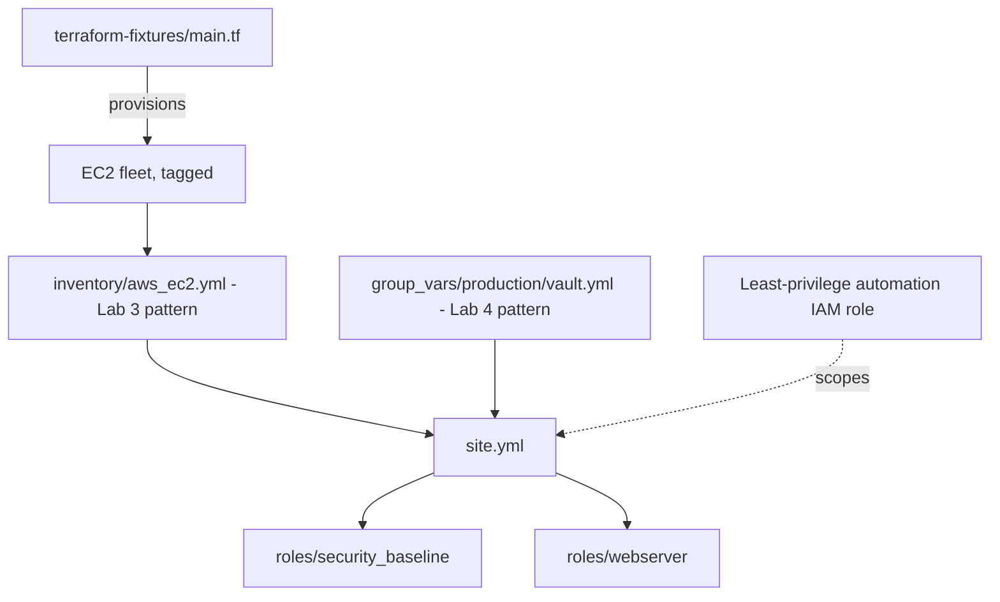

# Lab 7: AWS Configuration Management

## Objective
Configure a small, real EC2 fleet end-to-end using dynamic inventory (Lab 3), Vault-sourced secrets (Lab 4), and a security-baseline role — with IRSA-equivalent least-privilege IAM for the automation identity itself.

## Scenario
This lab combines everything so far into a realistic, minimal version of what a platform team actually does: launch a small EC2 fleet via Terraform, configure it via Ansible using dynamic inventory and vault-protected secrets, and verify the automation identity itself (not just the target hosts) follows least privilege.

## Skills Practised
- End-to-end integration: dynamic inventory + Vault + roles
- Cross-account/least-privilege IAM for the Ansible control identity
- `amazon.aws` modules for AWS-side configuration (e.g., tagging, SSM parameter read)
- The Terraform/Ansible boundary: Terraform provisions, Ansible configures — never both managing the same resource

## Architecture


## Prerequisites
- Completion of Labs 3, 4, and 5
- AWS account with permissions to launch EC2, and to create a least-privilege IAM role for the automation identity itself

## Directory Structure
```text
lab-07-aws-configuration-management/
├── README.md
├── ansible.cfg
├── inventory/aws_ec2.yml
├── terraform-fixtures/main.tf
├── iam/automation-role-policy.json
├── group_vars/production/vault.yml   (created via ansible-vault, per Lab 4)
├── roles/
│   ├── security_baseline/
│   └── webserver/
└── site.yml
```

## Step-by-Step Tasks
1. Review `iam/automation-role-policy.json` — a least-privilege policy for the identity running this playbook (only `ec2:DescribeInstances`, `ec2:DescribeTags`, `ssm:GetParameter` on a specific path — never broad `AdministratorAccess`).
2. Apply the Terraform fixture to launch the fleet.
3. Create `group_vars/production/vault.yml` per Lab 4's pattern with a test `api_key` value.
4. Run `ansible-playbook site.yml -i inventory/aws_ec2.yml --vault-id production@scripts/vault-password-production.sh`.
5. Confirm the `security_baseline` role applied correctly (see Validation).

## Ansible Configuration
See [`inventory/aws_ec2.yml`](inventory/aws_ec2.yml), [`roles/`](roles/), and [`site.yml`](site.yml).

## Commands to Execute
```bash
cd terraform-fixtures && terraform init && terraform apply && cd ..
ansible-galaxy collection install amazon.aws community.general
ansible-vault create --vault-id production@scripts/vault-password-production.sh group_vars/production/vault.yml
ansible-playbook site.yml -i inventory/aws_ec2.yml --vault-id production@scripts/vault-password-production.sh
```

## Expected Output
- The fleet is provisioned by Terraform, configured by Ansible — `terraform plan` after the Ansible run shows **zero** drift (Ansible never modified anything Terraform tracks, per the boundary discussion in `docs/eks-architecture.md`'s companion repo section).
- The `security_baseline` role's tasks (SSH hardening, automatic security updates) apply successfully across the fleet.

## Validation
```bash
ansible all -i inventory/aws_ec2.yml -m ansible.builtin.command -a "sshd -T" -b | grep permitrootlogin
terraform -chdir=terraform-fixtures plan   # should show "No changes"
```

## Failure Injection
Manually launch one additional EC2 instance via the AWS Console (not Terraform), tagged identically to the others. Run `ansible-playbook site.yml` again and observe it happily configures this untracked instance too — reproducing Category 5's Question 52 (the tag that decided everything) from the opposite angle: Ansible's tag-based targeting has no awareness of *how* an instance came to exist, only that it matches the tag filter.

## Troubleshooting Exercise
Temporarily broaden the automation IAM role to include `ec2:*` (simulating an over-permissioned identity) and use `aws iam simulate-principal-policy` to demonstrate the difference in blast radius versus the least-privilege policy — reinforcing Category 5's Question 47 (the role that could do almost anything) discussion.

## Cleanup
```bash
cd terraform-fixtures && terraform destroy
```
**Chargeable resources:** EC2 instances from the fixture — destroy promptly.

## Interview Questions Connected to This Lab
- [Question 43: Where Terraform ends and Ansible begins](../../interview-questions/05-aws-cloud-integration.md#question-43-where-terraform-ends-and-ansible-begins)
- [Question 47: The role that could do anything in every account](../../interview-questions/05-aws-cloud-integration.md#question-47-the-role-that-could-do-anything-in-every-account)
- [Question 52: The tag that decided everything](../../interview-questions/05-aws-cloud-integration.md#question-52-the-tag-that-decided-everything)

## Production Considerations
- Real fleets need the golden-AMI pattern from [Lab 8](../lab-08-packer-ami-baking/) for baseline configuration, reserving Ansible push-based runs for genuinely dynamic, frequently-changing operational tasks.
- This lab's IAM policy is illustrative — a real least-privilege policy should be derived from actual CloudTrail usage, per Question 47's guidance, not hand-guessed.

## Advanced Challenge
Extend `iam/automation-role-policy.json` into a real Terraform-managed IAM role and OIDC-federated trust policy (mirroring IRSA's pattern from the companion EKS repository) so the Ansible control identity itself uses short-lived, federated credentials rather than a long-lived access key.
