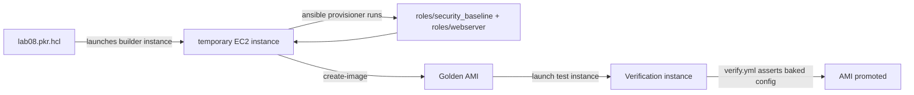

# Lab 8: Packer and Ansible AMI Baking

## Objective
Build a golden EC2 AMI using Packer's Ansible provisioner, baking in the security-baseline and web-server configuration from Lab 7 at build time rather than applying it at boot time — the immutable-infrastructure pattern discussed throughout this repository.

## Scenario
Your team currently boots plain Amazon Linux instances and configures them via a boot-time user-data script that runs a full Ansible playbook — slow, and prone to partial failure if the control node/network isn't reachable at exactly the right boot moment. You've been asked to move to a golden-AMI pattern: bake the configuration into the image itself via Packer + Ansible, so a launched instance is correctly configured from the moment it boots, with no runtime dependency on Ansible at all.

## Skills Practised
- Packer's `ansible-local` and `ansible` (remote) provisioners
- Reusing existing roles (Lab 7's `security_baseline`, `webserver`) unchanged inside a Packer build
- The golden-AMI-vs-boot-time-configuration trade-off (Category 12's Question 50)
- Keeping a baked AMI's kubelet/package versions in sync with a target environment (Ansible Question 59's EKS-AMI cross-reference)
- Validating a baked AMI via a test-launch-and-verify cycle before promoting it

## Architecture


## Prerequisites
- Packer >= 1.10 installed (`packer version`)
- Completion of [Lab 7](../lab-07-aws-configuration-management/) (reuses its roles)
- AWS permissions: `ec2:RunInstances`, `ec2:CreateImage`, `ec2:TerminateInstances`, `ec2:DescribeImages`

## Directory Structure
```text
lab-08-packer-ami-baking/
├── README.md
├── lab08.pkr.hcl
├── site.yml                 (the Ansible provisioner's playbook, run by Packer)
├── roles/                   (security_baseline, webserver - same content as Lab 7)
├── verify.yml
└── inventory/verify_hosts.ini
```

## Step-by-Step Tasks
1. Review `lab08.pkr.hcl` — note the `source` block (base AMI, instance type) and the `provisioner "ansible"` block referencing `site.yml`.
2. Run `packer validate lab08.pkr.hcl` to confirm the template's own syntax before building anything.
3. Run `packer build lab08.pkr.hcl` — Packer launches a temporary builder instance, runs the Ansible provisioner against it via SSH, then creates an AMI from the result and terminates the builder.
4. Launch a real EC2 instance from the resulting AMI (no Ansible run needed — verify it's already configured).
5. Run `verify.yml` against the launched test instance to assert nginx and the SSH hardening are already present from boot, confirming the bake worked.

## Ansible Configuration
See [`roles/`](roles/) (reused from Lab 7 unchanged) and [`verify.yml`](verify.yml).

## Commands to Execute
```bash
packer init lab08.pkr.hcl
packer validate lab08.pkr.hcl
packer build lab08.pkr.hcl
# Note the resulting AMI ID from Packer's output, then:
aws ec2 run-instances --image-id ami-XXXXXXXX --instance-type t3.micro --count 1 \
  --tag-specifications 'ResourceType=instance,Tags=[{Key=Name,Value=lab08-verify}]'
ansible-playbook verify.yml -i inventory/verify_hosts.ini
```

## Expected Output
- `packer build` completes with a new AMI ID printed at the end.
- The test instance launched from that AMI already has nginx running and `PermitRootLogin no` set — with zero Ansible runs performed against it after boot.
- `verify.yml` reports all assertions passing.

## Validation
```bash
ansible-playbook verify.yml -i inventory/verify_hosts.ini
```
Every assertion (nginx running, SSH hardening present) should pass without any configuration step having been applied post-boot — proof the bake is genuinely complete and self-sufficient.

## Failure Injection
Deliberately bake the AMI with an outdated package version constraint (pin `nginx` to a specific old version in the role temporarily), then let significant time pass conceptually (or just note the timestamp) — this demonstrates the core trade-off from Category 12's Question 50: a golden AMI's configuration is frozen at bake time, and only a fresh bake (or a scheduled instance-refresh) picks up newer package versions, unlike a boot-time playbook that would always fetch "latest" at every boot.

## Troubleshooting Exercise
Intentionally break SSH connectivity in the Packer template (wrong `ssh_username` for the base AMI) and run `packer build` — observe Packer's own timeout/retry behavior and the specific error message, distinguishing a Packer-level connectivity failure from an Ansible-level task failure (which would only ever occur *after* Packer's own SSH connection to the builder succeeds).

## Cleanup
```bash
aws ec2 terminate-instances --instance-ids <verify-instance-id>
aws ec2 deregister-image --image-id <ami-id>
```
**Chargeable resources:** the AMI's underlying EBS snapshot persists (small cost) until deregistered — always deregister test AMIs promptly.

## Interview Questions Connected to This Lab
- [Question 40: The node bootstrap that diverged from the AMI](../../interview-questions/04-modules-plugins.md#question-40-the-laptop-that-drifted-from-ci) — golden-AMI vs. boot-time user-data drift
- [Question 50: Rolling update or fresh cattle?](../../interview-questions/05-aws-cloud-integration.md#question-50-rolling-update-or-fresh-cattle) — the in-place-vs-immutable trade-off this lab demonstrates directly
- [Question 59: The AMI that Ansible baked, but Kubernetes wouldn't boot correctly](../../interview-questions/06-kubernetes-containers.md#question-59-the-ami-that-ansible-baked-but-kubernetes-wouldnt-boot-correctly)

## Production Considerations
- A real golden-AMI pipeline runs on a scheduled cadence (weekly/monthly) plus on-demand for urgent security patches, feeding into an ASG instance-refresh — see the companion Terraform repository's ASG guidance.
- This same pattern is exactly what produces the custom EKS node AMI discussed in the companion EKS repository — the Packer template would instead reference an EKS-optimized base AMI and the EKS bootstrap script.

## Advanced Challenge
Extend `lab08.pkr.hcl` to build for two different base AMIs (Amazon Linux 2023 and Ubuntu 22.04) in parallel using Packer's multi-builder support, confirming the *same* Ansible roles apply correctly to both OS families (exercising the `ansible_facts['os_family']`-conditional tasks already present in `security_baseline`).
