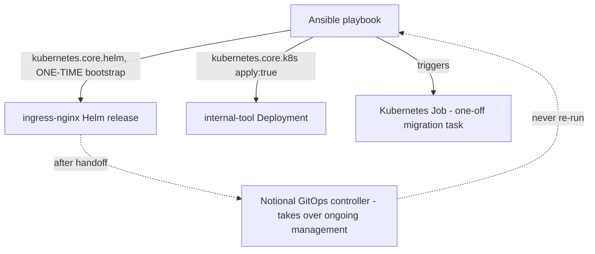

# Lab 9: Kubernetes and Helm

## Objective
Use Ansible's `kubernetes.core` collection to bootstrap a cluster's foundational Helm releases correctly — then deliberately hand off ongoing management to demonstrate (and avoid) the Ansible/GitOps dual-ownership conflict from Category 6.

## Scenario
Your team needs to bootstrap a brand-new EKS (or kind/minikube, for this lab) cluster with the AWS Load Balancer Controller-equivalent and an internal tool, using Ansible for the one-time bootstrap. You've been asked to do this correctly — using server-side apply for idempotency, and explicitly retiring the bootstrap playbook's authority once a GitOps controller notionally takes over, rather than leaving it as a standing, re-runnable conflict.

## Skills Practised
- `kubernetes.core.helm` for installing/managing Helm releases from Ansible
- `kubernetes.core.k8s` with `apply: true` (server-side apply) for correct idempotency
- Explicit `context`/`kubeconfig` targeting (never ambient context)
- The Ansible-bootstrap-then-GitOps-handoff pattern and its dual-ownership trap
- A Kubernetes `Job` triggered by Ansible for a one-off task, instead of SSH/exec

## Architecture


## Prerequisites
- A local Kubernetes cluster: `kind create cluster --name ansible-lab09` (or minikube/an existing EKS cluster)
- `kubernetes.core` collection: `ansible-galaxy collection install kubernetes.core`
- `kubectl` and `helm` installed locally (kubernetes.core shells out to `helm` under the hood)

## Directory Structure
```text
lab-09-kubernetes-and-helm/
├── README.md
├── ansible.cfg
├── bootstrap.yml
├── manifests/internal-tool-deployment.yml
└── inventory/hosts.ini
```

## Step-by-Step Tasks
1. Create the local cluster: `kind create cluster --name ansible-lab09`.
2. Review `bootstrap.yml` — note the explicit `context: kind-ansible-lab09` on every Kubernetes-targeting task (never relying on ambient `kubectl` context, per Category 6's Question 56).
3. Run `ansible-playbook bootstrap.yml` and confirm both the Helm release and the raw Deployment apply successfully.
4. Run the playbook a second time and confirm `changed: false` for both — server-side apply's correct idempotency.
5. Review the Job-triggering task and confirm it correctly waits for the Job's completion status before considering the play successful.
6. Read the README's own "handoff" note: after this bootstrap, ongoing management of `ingress-nginx` and `internal-tool` would move to a GitOps controller — this playbook should never be re-run against a cluster once that handoff has happened (Category 6's Question 55).

## Ansible Configuration
See [`bootstrap.yml`](bootstrap.yml) and [`manifests/`](manifests/).

## Commands to Execute
```bash
kind create cluster --name ansible-lab09
ansible-galaxy collection install kubernetes.core
ansible-playbook bootstrap.yml
ansible-playbook bootstrap.yml   # run again - expect changed=0 for the Helm/k8s tasks
kubectl --context kind-ansible-lab09 get jobs
```

## Expected Output
- First run: `ingress-nginx` Helm release installed, `internal-tool` Deployment created, migration Job runs to completion.
- Second run: `changed: false` for the Helm release and the Deployment (server-side apply correctly detects no drift); the Job task is skipped or handled idempotently (see the task's own `creates`-equivalent guard).

## Validation
```bash
kubectl --context kind-ansible-lab09 get deployment internal-tool -o jsonpath='{.status.readyReplicas}'
kubectl --context kind-ansible-lab09 get job lab09-migration -o jsonpath='{.status.succeeded}'
```
Both should return `1`, confirming the bootstrap succeeded and is genuinely idempotent.

## Failure Injection
Reproduce Category 6's Question 54 (the k8s module that wasn't quite idempotent): temporarily change `apply: true` to omit it entirely (falling back to client-side diffing) on the Deployment task, and re-run the playbook twice in succession. Observe whether `changed: true` now appears on the second run due to server-side normalization differences — compare against the `apply: true` behavior.

## Troubleshooting Exercise
Reproduce Category 6's Question 56 (the ambient-context risk): remove the explicit `context:` parameter from one task, set your local `kubectl` context to something else entirely (`kubectl config use-context docker-desktop`, if available, or any other context), and re-run the playbook. Observe it now targets the wrong cluster context — restore the explicit `context:` parameter and confirm this is no longer possible.

## Cleanup
```bash
kind delete cluster --name ansible-lab09
```
**Chargeable resources:** none (local `kind` cluster).

## Interview Questions Connected to This Lab
- [Question 54: The k8s module that wasn't quite idempotent the way they expected](../../interview-questions/06-kubernetes-containers.md#question-54-the-k8s-module-that-wasnt-quite-idempotent-the-way-they-expected)
- [Question 55: The bootstrap that outlived its purpose](../../interview-questions/06-kubernetes-containers.md#question-55-the-bootstrap-that-outlived-its-purpose)
- [Question 56: One kubeconfig, five clusters, one very confused playbook](../../interview-questions/06-kubernetes-containers.md#question-56-one-kubeconfig-five-clusters-one-very-confused-playbook)
- [Question 57: The one-off task that didn't need a whole playbook run](../../interview-questions/06-kubernetes-containers.md#question-57-the-one-off-task-that-didnt-need-a-whole-playbook-run)

## Production Considerations
- A real bootstrap-then-handoff would transition to the companion EKS repository's [Lab 10 — GitOps with ArgoCD](../../../eks/eks-senior-interview-preparation/labs/lab-10-gitops-argocd/) — this lab's `bootstrap.yml` is intentionally scoped to a one-time, pre-GitOps bootstrap only.
- Production Kubernetes-targeting Ansible should always use IRSA/Pod-Identity-equivalent scoped credentials for whatever identity the control node authenticates to the cluster as, never a broad, shared kubeconfig admin credential.

## Advanced Challenge
Add a second Ansible-triggered `Job` performing a deliberately-idempotent operation (e.g., checking whether a specific ConfigMap key already has a desired value before doing any work), and confirm via `kubectl get jobs` history that re-running the playbook doesn't create a duplicate Job each time — designing genuine idempotency for a "trigger a Job" pattern, not just relying on Ansible's own module idempotency.
