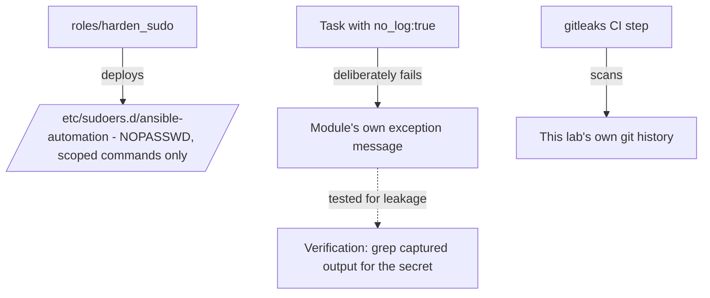

# Lab 10: Security Hardening

## Objective
Build a full security-hardening pipeline: passwordless, command-scoped `sudo` instead of a shared `become` password; `no_log` verified against its actual failure-path limits; and a secret-scanning CI gate catching accidentally-committed plaintext credentials.

## Scenario
A security audit of your team's automation has just found three separate issues, mirroring Category 7's questions directly: a shared `become` password used fleet-wide, a `no_log`'d task whose error path still leaked a token, and several plaintext credentials in `group_vars` nobody noticed. This lab fixes all three, hands-on.

## Skills Practised
- Passwordless, command-scoped `sudoers` configuration deployed via Ansible
- Verifying `no_log`'s actual scope against a deliberate failure-path test
- `gitleaks`-based secret scanning as a CI gate
- Least-privilege privilege-escalation design

## Architecture


## Prerequisites
- Completion of [Lab 1](../lab-01-core-workflow/)
- `gitleaks` installed (`brew install gitleaks` or see https://github.com/gitleaks/gitleaks)

## Directory Structure
```text
lab-10-security-hardening/
├── README.md
├── ansible.cfg
├── inventory/hosts.ini
├── roles/harden_sudo/
├── site.yml
└── .gitleaks.toml
```

## Step-by-Step Tasks
1. Review `roles/harden_sudo/tasks/main.yml` — note the `NOPASSWD:` sudoers entry scoped to only `systemctl restart nginx` and `apt-get install *`, not `ALL`.
2. Apply the role and confirm the automation user can run the scoped command without a password, but is denied for anything outside the scope.
3. Run the `no_log_test` play and deliberately trigger its failure condition — capture the full output and grep it for the secret value to confirm whether it leaked (per Category 7's Question 62).
4. Run `gitleaks detect --source . --verbose` against this lab's directory and confirm it's clean — then deliberately add a fake plaintext credential to a test file and re-run to confirm it's caught.

## Ansible Configuration
See [`roles/harden_sudo/`](roles/harden_sudo/) and [`site.yml`](site.yml).

## Commands to Execute
```bash
docker run -d --name lab10-target --privileged \
  --cgroupns=host -v /sys/fs/cgroup:/sys/fs/cgroup:rw \
  geerlingguy/docker-ubuntu2204-ansible:latest
ansible-playbook site.yml --tags harden_sudo
ansible-playbook site.yml --tags no_log_test 2>&1 | tee /tmp/lab10-output.log
grep -i "super-secret-token" /tmp/lab10-output.log   # check whether it leaked
gitleaks detect --source . --verbose
```

## Expected Output
- After `harden_sudo`, the automation user can run the two whitelisted commands via `sudo` without a password, and is denied (password required, then rejected) for anything else.
- The `no_log_test` grep either finds nothing (no_log worked completely) or finds the secret in the module's own exception message (demonstrating Category 7's Question 62's exact gap) — either result is instructive.
- `gitleaks detect` reports clean on the actual repository content.

## Validation
```bash
docker exec lab10-target sudo -l -U automation_user
```
Should show only the two specific, whitelisted `NOPASSWD` commands, not `(ALL) ALL`.

## Failure Injection
Add a fake plaintext-looking credential (`api_key: "sk-live-abc123fake"`) to a new, uncommitted test file, and run `gitleaks detect --source . --verbose` again. Confirm it's flagged — then remove the test file before committing anything for real.

## Troubleshooting Exercise
Temporarily broaden the sudoers entry to `ALL=(ALL) NOPASSWD: ALL` (reproducing Category 7's Question 67's anti-pattern), and use `sudo -l -U automation_user` to see the difference in scope — restore the narrow, command-specific entry afterward.

## Cleanup
```bash
docker rm -f lab10-target
```
**Chargeable resources:** none.

## Interview Questions Connected to This Lab
- [Question 62: The no_log that logged anyway](../../interview-questions/07-security-vault.md#question-62-the-no_log-that-logged-anyway)
- [Question 66: The compliance scan that found secrets in plain sight](../../interview-questions/07-security-vault.md#question-66-the-compliance-scan-that-found-secrets-in-plain-sight)
- [Question 67: The become password that became everyone's problem](../../interview-questions/07-security-vault.md#question-67-the-become-password-that-became-everyones-problem)

## Production Considerations
- Real production sudoers scoping should be derived from actual observed automation needs (which specific commands each playbook genuinely runs with `become`), not guessed.
- Real `gitleaks`/secret-scanning should run as a mandatory, non-bypassable CI gate (see [Lab 12](../lab-12-cicd-pipeline/)), not a manual, occasionally-run local command.

## Advanced Challenge
Extend `roles/harden_sudo` to generate the sudoers command whitelist automatically from a scan of every `become: true` task across the playbook library (a small script parsing task files for their actual module/command usage), rather than a manually-maintained list — closing the gap between "what's whitelisted" and "what's actually needed" proactively.
