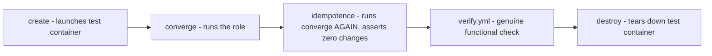

# Lab 11: Molecule Testing

## Objective
Build a full Molecule test scenario (`create` → `converge` → `idempotence` → `verify` → `destroy`) for the Lab 2 `webserver` role, including a genuinely functional `verify.yml` — not just a shallow service-status check.

## Scenario
Your `webserver` role has "always worked" but has never had automated tests. You've been asked to add a Molecule scenario proving both its idempotency and its actual functional correctness (not just "the process exists"), directly closing the gap from Category 9's Question 79.

## Skills Practised
- Molecule scenario structure (`molecule.yml`, `converge.yml`, `verify.yml`)
- Docker driver configuration for Molecule
- The `idempotence` stage as an enforced, automated proof (not just eyeballing a second run)
- Writing a genuinely functional `verify.yml` (an actual HTTP request, not just "service is running")
- `molecule test` as a single command running the full cycle

## Architecture


## Prerequisites
- `pip install molecule molecule-plugins[docker]`
- Docker installed and running
- The `webserver` role from [Lab 2](../lab-02-roles-and-structure/) (copied into this lab's `roles/` for self-containment)

## Directory Structure
```text
lab-11-molecule-testing/
├── README.md
├── roles/
│   └── webserver/
│       ├── ... (same as Lab 2)
│       └── molecule/
│           └── default/
│               ├── molecule.yml
│               ├── converge.yml
│               └── verify.yml
```

## Step-by-Step Tasks
1. Review `molecule/default/molecule.yml` — note the Docker driver platform definition and the `idempotence` stage already included in Molecule's default test sequence.
2. Review `verify.yml` — note it makes an actual HTTP request to the deployed nginx instance and asserts on the response, not just checking `service_facts`.
3. Run `molecule test` from inside `roles/webserver/` and watch all five stages execute in order.
4. Deliberately break idempotency (add a `command: touch /tmp/marker` task with no guard to the role) and re-run `molecule test` — confirm the `idempotence` stage now fails explicitly, exactly reproducing Category 1's Question 1.
5. Revert the break, then deliberately weaken `verify.yml` to only check `service_facts` (removing the HTTP-request assertion) and confirm it would have missed a scenario where nginx runs but serves nothing correctly (simulate by pointing the check at a wrong port).

## Ansible Configuration
See [`roles/webserver/molecule/default/`](roles/webserver/molecule/default/).

## Commands to Execute
```bash
pip install molecule molecule-plugins[docker]
cd roles/webserver
molecule test
```

## Expected Output
- All five stages (`create`, `converge`, `idempotence`, `verify`, `destroy`) complete successfully.
- `verify.yml`'s HTTP-request assertion passes, confirming genuine functional correctness, not just process presence.

## Validation
The `molecule test` command's own exit code (0 = success) and full stage-by-stage output serve as the validation — a passing `idempotence` stage specifically proves the role produces zero changes on a second run, mechanically, not by eyeballing.

## Failure Injection
Add the non-idempotent `command: touch /tmp/marker-{{ ansible_date_time.epoch }}` task (no guard) to `tasks/main.yml`, run `molecule converge` twice manually, then `molecule idempotence` — confirm it fails, explicitly naming the non-idempotent task. Remove the task afterward.

## Troubleshooting Exercise
Change `verify.yml` to only assert `ansible_facts.services['nginx.service'].state == 'running'` (removing the HTTP check), then deliberately misconfigure the role's listen port in a way that leaves nginx "running" but not actually serving on the expected port. Confirm the weakened `verify.yml` passes anyway — reproducing Category 9's Question 79 exactly. Restore the full HTTP-based `verify.yml`.

## Cleanup
Molecule's `destroy` stage (run automatically as part of `molecule test`, or manually via `molecule destroy`) removes all test containers — no manual cleanup needed.

## Interview Questions Connected to This Lab
- [Question 79: The Molecule test that passed on a lie](../../interview-questions/09-testing-validation.md#question-79-the-molecule-test-that-passed-on-a-lie)
- [Question 80: The idempotence stage that lied about idempotency](../../interview-questions/09-testing-validation.md#question-80-the-idempotence-stage-that-lied-about-idempotency)
- [Question 82: The role that had no idea it broke someone else](../../interview-questions/09-testing-validation.md#question-82-the-role-that-had-no-idea-it-broke-someone-else)

## Production Considerations
- Real, widely-shared roles need the contract-test-matrix pattern from Question 82 — multiple Molecule scenarios (not just `default`) testing against representative real consumer variable configurations.
- Molecule scenarios should run automatically in CI on every PR (see [Lab 12](../lab-12-cicd-pipeline/)), not just manually as in this lab.

## Advanced Challenge
Add a second Molecule scenario, `molecule/production-like/`, using a platform image closer to actual production characteristics (per Category 9's Question 80) rather than the default scenario's generic base image, and confirm both scenarios pass independently via `molecule test -s production-like`.
