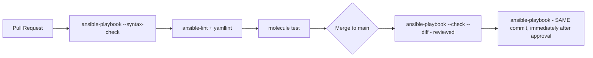

# Lab 12: CI/CD Pipeline

## Objective
Build a complete GitHub Actions pipeline for an Ansible role: lint → Molecule test → syntax-check → a simulated "review then apply" gate — closing the honest capability gap between this and Terraform's plan-artifact model.

## Scenario
Your team has been running `ansible-playbook` manually from laptops. You've been asked to build a real CI pipeline enforcing lint, testing, and a reviewed-then-applied change process — while being honest with the team about exactly what Ansible's `--check` mode does and doesn't guarantee versus Terraform's plan/apply model.

## Skills Practised
- `ansible-lint` and `yamllint` as CI gates
- `molecule test` running inside CI (Docker-in-Docker or a GitHub Actions service container)
- `ansible-playbook --syntax-check` as the fast, first-line gate (and its narrow, honestly-limited scope)
- Minimizing the check-to-apply drift window (same pinned commit/EE image for both)
- Concurrency control (`concurrency:` group) preventing two runs targeting the same environment simultaneously

## Architecture


## Prerequisites
- A GitHub repository (fork/clone this lab directory as its own repo, or adapt the workflow to your CI system of choice)
- Completion of [Lab 11](../lab-11-molecule-testing/)

## Directory Structure
```text
lab-12-cicd-pipeline/
├── README.md
├── .github/workflows/ci.yml
├── roles/webserver/          (same as Lab 11, with its molecule/ scenario)
└── site.yml
```

## Step-by-Step Tasks
1. Review `.github/workflows/ci.yml` — note the four sequential jobs: `syntax-check`, `lint`, `molecule-test`, `deploy` (the last gated behind a GitHub Environment requiring manual approval).
2. Note the `concurrency:` block on the `deploy` job — preventing two simultaneous runs from targeting the same environment (Category 8's Question 77).
3. Push a deliberately-broken change (invalid YAML) and confirm it fails at the `syntax-check` stage, never reaching lint or Molecule.
4. Push a deliberately-non-idempotent task and confirm it's caught at the `molecule-test` stage specifically (not syntax-check or lint).
5. Push a valid change and walk it through to the `deploy` job's manual approval gate.

## Ansible Configuration
See [`.github/workflows/ci.yml`](.github/workflows/ci.yml) and [`roles/webserver/`](roles/webserver/).

## Commands to Execute
```bash
# Locally, before pushing, run the same checks CI will run:
ansible-playbook site.yml --syntax-check
ansible-lint .
yamllint .
(cd roles/webserver && molecule test)
```

## Expected Output
- Each local command matches exactly what CI runs — no "works on my machine, fails in CI" surprises, since both use the same commands.
- The GitHub Actions run shows four sequential jobs, each gating the next.

## Validation
Check the GitHub Actions run summary — all four jobs should show green checkmarks in sequence, with `deploy` showing a "Waiting for approval" state until manually approved.

## Failure Injection
Push a change that passes `molecule test` locally in isolation but would conflict with another team's concurrent change to the same environment (simulate by manually triggering two workflow runs targeting the same `concurrency.group` value in quick succession) — confirm the second run queues rather than running concurrently, reproducing Category 8's Question 77 fix.

## Troubleshooting Exercise
Remove the `concurrency:` block from the `deploy` job and manually trigger two runs simultaneously (via `gh workflow run` twice in quick succession). Observe both attempt to run at once — restore the `concurrency:` block and confirm the second run now correctly queues instead.

## Cleanup
No cloud resources — this lab's `deploy` job is illustrative/simulated (`echo "would deploy here"`) rather than a real deployment, to keep the lab safely repeatable without real infrastructure risk.

## Interview Questions Connected to This Lab
- [Question 72: The plan Ansible never had](../../interview-questions/08-cicd-automation.md#question-72-the-plan-ansible-never-had)
- [Question 73: The Execution Environment that drifted from every developer's laptop](../../interview-questions/08-cicd-automation.md#question-73-the-execution-environment-that-drifted-from-every-developers-laptop)
- [Question 77: The concurrent AWX runs that collided](../../interview-questions/08-cicd-automation.md#question-77-the-concurrent-awx-runs-that-collided)

## Production Considerations
- A real pipeline would use `ansible-navigator` against a pinned Execution Environment image (Question 73) for both local development and CI, not GitHub Actions' own ad hoc `pip install ansible`.
- Real production `deploy` jobs would use AWX/Automation Platform (see the docs' AWX architecture material) rather than raw `ansible-playbook` invoked directly from a GitHub Actions runner.

## Advanced Challenge
Add a `kyverno test`-equivalent policy-check job (using a simple custom `ansible-lint` rule per Category 13's Question 111) as a fifth CI stage, specifically checking for the firewall-disabling anti-pattern, and confirm it correctly blocks a deliberately-introduced test violation before it ever reaches Molecule testing.
