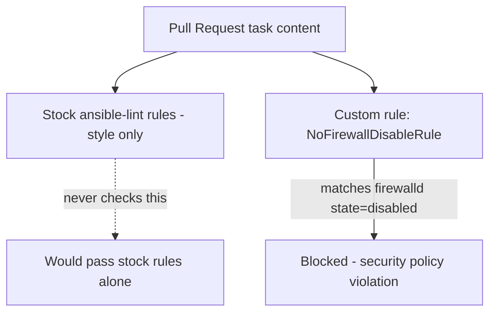

# Lab 13: Policy as Code

## Objective
Write a custom `ansible-lint` rule catching an organization-specific security violation (a task disabling the host firewall) that stock `ansible-lint` rules would never catch — directly closing the gap from Category 13's Question 111.

## Scenario
A PR that disabled a host's firewall entirely passed `ansible-lint` cleanly and merged, since `ansible-lint`'s built-in rules check style, not organizational security policy. You've been asked to add a custom rule closing this specific gap, and design the rollout (audit mode first) so it doesn't immediately break the existing codebase.

## Skills Practised
- Writing a custom `ansible-lint` rule (Python-based, matching task content)
- Distinguishing style/best-practice linting from security-policy enforcement
- Audit-mode-first policy rollout (mirroring the OPA/Kyverno rollout discipline from the companion EKS repository)
- `ansible-lint -r` to load a custom rules directory

## Architecture


## Prerequisites
- `ansible-lint` >= 6.0 (`pip install ansible-lint`)

## Directory Structure
```text
lab-13-policy-as-code/
├── README.md
├── .ansible-lint
├── custom_rules/
│   └── no_firewall_disable.py
├── playbooks/
│   ├── compliant.yml
│   └── violating.yml
└── tests/
    └── test_no_firewall_disable.py
```

## Step-by-Step Tasks
1. Review `custom_rules/no_firewall_disable.py` — note it matches any task using the `ansible.posix.firewalld` module with `state: disabled`.
2. Run `ansible-lint -r custom_rules/ playbooks/violating.yml` and confirm it's flagged by the custom rule specifically (not any stock rule).
3. Run the same command against `playbooks/compliant.yml` and confirm it passes cleanly.
4. Review `.ansible-lint`'s config — note the custom rule is initially in `warn_list` (audit mode), not blocking, per the standard rollout discipline.
5. After confirming no unexpected false positives across a representative sample, move the rule from `warn_list` to full enforcement (remove it from `warn_list`).

## Ansible Configuration
See [`custom_rules/no_firewall_disable.py`](custom_rules/no_firewall_disable.py) and [`playbooks/`](playbooks/).

## Commands to Execute
```bash
pip install ansible-lint
ansible-lint -r custom_rules/ playbooks/violating.yml    # audit mode: warns, doesn't fail exit code
ansible-lint -r custom_rules/ playbooks/compliant.yml    # passes cleanly
python -m pytest tests/                                    # unit test for the rule itself
```

## Expected Output
- `violating.yml` shows a `WARNING` (not `ERROR`, while in `warn_list`) specifically naming the custom rule.
- `compliant.yml` shows no findings at all.
- The pytest suite confirms the rule's own matching logic is correct, independent of running it against real playbooks.

## Validation
```bash
ansible-lint -r custom_rules/ playbooks/violating.yml --nocolor | grep "no-firewall-disable"
```
Confirms the custom rule specifically (by its ID) is what caught the violation.

## Failure Injection
Move the rule out of `warn_list` in `.ansible-lint` (full enforcement) and re-run against `violating.yml` — confirm `ansible-lint`'s exit code is now non-zero, which would correctly fail a CI gate (see [Lab 12](../lab-12-cicd-pipeline/)).

## Troubleshooting Exercise
Add a second, unrelated `ansible.posix.firewalld` task with `state: enabled` (not disabled) to `playbooks/compliant.yml`, and confirm the rule correctly does NOT flag it — verifying the rule's matching logic is precise (only flags `disabled`, not any firewalld usage at all).

## Cleanup
No cloud resources — this lab is entirely local, static analysis.

## Interview Questions Connected to This Lab
- [Question 111: The lint pass that let a policy violation through](../../interview-questions/13-governance-policy.md#question-111-the-lint-pass-that-let-a-policy-violation-through)
- [Question 112: The policy that only existed in one person's head](../../interview-questions/13-governance-policy.md#question-112-the-policy-that-only-existed-in-one-persons-head)
- [Question 113: The policy exception that ate the whole policy](../../interview-questions/13-governance-policy.md#question-113-the-policy-exception-that-ate-the-whole-policy)

## Production Considerations
- A real organization would maintain a small library of custom rules (not just this one), each with its own unit test, covering every "we should never do X" rule extracted from senior engineers' tacit knowledge (Question 112).
- Real exception handling should use scoped, justified, dated exceptions (via a documented process) rather than an ever-growing, unreviewed `skip_list` (Question 113).

## Advanced Challenge
Add a second custom rule catching hardcoded credentials in `vars`/`defaults` files (a simple regex-based check for common credential-shaped key names with plaintext-looking values), and write its own unit test suite following the same pattern as `no_firewall_disable`.
