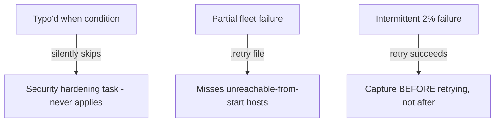

# Lab 14: Troubleshooting and Recovery

## Objective
Reproduce and diagnose three real troubleshooting patterns from Category 10 hands-on: a silently-skipped conditional due to a variable typo, a `--retry` file that misses unreachable hosts, and an intermittent failure investigated with proper evidence capture.

## Scenario
You're on-call, and three separate, confusing symptoms show up in a single week. This lab reproduces each in a safe, disposable environment so you build the actual diagnostic muscle memory rather than just reading about it.

## Skills Practised
- Diagnosing a silently-skipped task via `when` referencing an undefined variable
- Understanding `.retry` file limitations versus deriving complete host-coverage from `PLAY RECAP`
- Evidence-capture discipline for an intermittent, retry-succeeds failure
- `-vvv` verbose output for real diagnostic investigation

## Architecture


## Prerequisites
- Completion of [Lab 1](../lab-01-core-workflow/)

## Directory Structure
```text
lab-14-troubleshooting-and-recovery/
├── README.md
├── ansible.cfg
├── inventory/hosts.ini
├── scenario1_typo_conditional.yml
├── scenario2_partial_failure.yml
└── scenario3_intermittent.yml
```

## Step-by-Step Tasks

### Scenario 1: The silently-skipped conditional
1. Run `ansible-playbook scenario1_typo_conditional.yml -e environment=production` and note the security-hardening task reports `skipping` with no error.
2. Run with `-vvv` and inspect the `when` evaluation — spot the typo (`evironment` vs `environment`).
3. Fix the typo and re-run, confirming the task now actually executes.
4. Add the `assert` guard shown in the file (commented) and confirm it now fails loudly instead of silently skipping if the typo recurs.

### Scenario 2: Incomplete `.retry` coverage
1. Run `scenario2_partial_failure.yml` against the provided inventory (includes one genuinely unreachable host by design).
2. Inspect the generated `.retry` file's contents versus the full `PLAY RECAP`.
3. Derive the *actual* complete list of non-succeeded hosts from the recap (per the README's documented technique) and compare against `.retry`'s (possibly incomplete) list.

### Scenario 3: Intermittent failure evidence capture
1. Run `scenario3_intermittent.yml` five times in a loop (`for i in {1..5}; do ansible-playbook scenario3_intermittent.yml; done`) — it fails roughly 20% of the time by design (a simulated race condition).
2. On the first failure, capture full `-vvv` output to a timestamped log **before** retrying (per the discipline from Question 98).
3. After several captured occurrences, look for a pattern.

## Ansible Configuration
See the three scenario playbooks in this directory.

## Commands to Execute
```bash
ansible-playbook scenario1_typo_conditional.yml -e environment=production -vvv
ansible-playbook scenario2_partial_failure.yml -i inventory/hosts.ini
cat scenario2_partial_failure.retry
for i in {1..5}; do
  ansible-playbook scenario3_intermittent.yml -vvv 2>&1 | tee "/tmp/lab14-run-$i.log"
done
```

## Expected Output
- Scenario 1: the task silently skips due to the typo, with no error — until the `assert` guard is added.
- Scenario 2: `.retry` may not include every genuinely-failed host category; deriving from the full recap is the reliable method.
- Scenario 3: roughly 1 in 5 runs fails, with captured evidence available for pattern analysis across the 5 attempts.

## Validation
For Scenario 1, confirm via `-vvv` output that the fixed condition (`environment == "production"`) now evaluates `true` and the task executes.

## Failure Injection
Each scenario *is* the failure injection exercise — see Step-by-Step Tasks above for each.

## Troubleshooting Exercise
For Scenario 3, after capturing all 5 runs' evidence, compare the failing runs' timestamps/output for any common thread (a specific task, a specific timing pattern) — this is the actual diagnostic process Question 98 describes, practiced hands-on rather than just discussed.

## Cleanup
```bash
rm -f *.retry /tmp/lab14-run-*.log
```
**Chargeable resources:** none.

## Interview Questions Connected to This Lab
- [Question 87: The retry file that told half the story](../../interview-questions/10-troubleshooting.md#question-87-the-retry-file-that-told-half-the-story)
- [Question 92: The playbook that succeeded by doing nothing](../../interview-questions/10-troubleshooting.md#question-92-the-playbook-that-succeeded-by-doing-nothing)
- [Question 98: The incident nobody could reproduce because nobody kept the evidence](../../interview-questions/10-troubleshooting.md#question-98-the-incident-nobody-could-reproduce-because-nobody-kept-the-evidence)

## Production Considerations
- Real fleets should build the structured, machine-readable run-report (a JSON callback plugin) mentioned in Question 87's fix, rather than relying on grep-based recap parsing as this lab demonstrates manually.
- Real intermittent-failure investigation should correlate captured evidence against infrastructure-level signals (network, resource utilization) — this lab's simulated race condition is simplified for reproducibility.

## Advanced Challenge
Write a small Python callback plugin producing a structured JSON summary of every run (host, task, result, timestamp) as a more reliable alternative to both `.retry` files and manual `-vvv` log parsing, and use it to automatically flag any host not in an `ok`/`changed` state at the end of a run.
