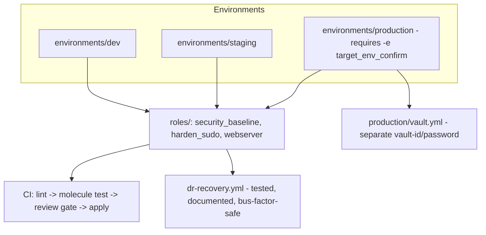

# Operations Reference — Enterprise Capstone

This document is the operational deliverable for the capstone — the kind of reference a new on-call engineer should be able to use to understand, operate, and recover this platform without needing to ask the person who built it.

## Architecture

## Cross-component dependencies

- Every environment shares the **same** `roles/` library — a role change is tested once (via Molecule, Lab 11) and applies consistently everywhere, never duplicated per environment.
- `production`'s vault password is fetched via its own dedicated script (`scripts/vault-password-production.sh`), entirely separate from any other environment's — compromising one environment's vault password never exposes another's (Lab 4 / Category 7 Question 63).
- The CI pipeline (`.github/workflows/ci.yml`) runs the *same* lint/Molecule commands a developer would run locally — no "works on my machine" gap (Category 8 Question 73).
- `dr-recovery.yml` has **no dependency on any specific person's memory** — it's designed to be run by whoever is on-call, using only its own inline documentation, and should be periodically re-validated by someone who didn't write it (Category 11 Question 108).

## Cost considerations

This capstone runs entirely against local Docker containers — zero cloud cost. If adapted to real AWS/EC2 targets (per Lab 7's pattern), budget for:
- EC2 instance costs for however many hosts each environment represents
- No additional Ansible-specific cost — Ansible itself is agentless and has no per-host licensing cost, unlike some commercial configuration-management alternatives

## Security considerations

- Vault passwords are never committed in any form — sourced dynamically via scripts, per Lab 4.
- `become` uses scoped, passwordless `sudoers` entries (Lab 10), never a shared password with broad privileges.
- A custom `ansible-lint` rule (Lab 13) blocks the specific, known-dangerous firewall-disabling pattern before it can merge.
- Production requires explicit, deliberate confirmation (`-e target_env_confirm=yes-production`) before any run can target it — friction that's intentional, not an oversight.

## Scaling considerations

At fleet sizes beyond what this local-Docker capstone demonstrates, apply Category 12's performance guidance directly:
- Tune `forks` to the control node's validated capacity (Question 105)
- Choose `linear` vs. `free` execution strategy deliberately, informed by actual task-completion-time variance (Question 106)
- Filter fact-gathering to only what's actually used (Question 107)
- Enable SSH pipelining (Question 108)
- Cache dynamic inventory resolution appropriately (Question 109, and Lab 3/Category 5's Question 49)

## Disaster recovery

`dr-recovery.yml` is this platform's own recovery mechanism. It has been deliberately designed and should be periodically tested against the discipline established in Category 11:
- **Rotating ownership** (Question 108): whoever runs the periodic DR drill should not be the same person every time.
- **Explicit RTO measurement** (Question 103): time the actual drill; don't rely on an old estimate.
- **Data vs. configuration** (Question 101): this playbook handles *configuration* convergence only — any real stateful dependency (a database) needs its own, separate, explicitly-tested backup/restore mechanism, never assumed to be covered by configuration-management convergence alone.

## On-call runbook: common issues

| Symptom | Likely cause | Reference |
|---|---|---|
| Production run blocked immediately | Missing `-e target_env_confirm=yes-production` | Lab 5, Question 16 |
| Vault decryption error | Wrong `--vault-id`/password script for the target environment | Lab 4, Question 63 |
| Task reports `changed: true` on every run | Missing idempotency guard (`command`/`shell` without `creates`/`changed_when`) | Category 1, Question 1 |
| CI fails at `molecule-test` but not `lint` | A role logic/idempotency issue, not a style issue | Lab 11, Category 9 Question 79 |
| Sudoers-scoped task fails with permission denied | The specific command isn't in `harden_sudo`'s whitelist | Lab 10, Question 67 |
