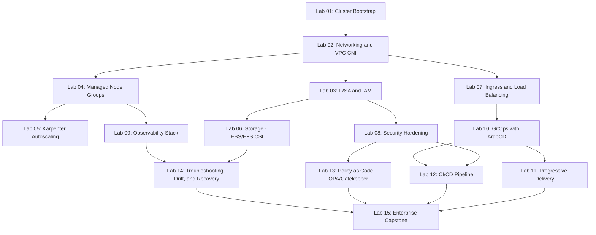

# EKS (Amazon Elastic Kubernetes Service) Senior Interview Preparation

An exhaustive, hands-on preparation repository for senior/staff-level DevOps, Platform, and SRE interviews focused on Amazon EKS and production Kubernetes operations. This is the third repository in a three-part series — see the companion [Terraform](../../terraform/terraform-senior-interview-preparation/) and [Ansible](../../ansible/ansible-senior-interview-preparation/) repositories, which this repo cross-references throughout (Terraform provisions the EKS cluster/node infrastructure; Ansible is largely out of scope once workloads are Kubernetes-native, a distinction covered explicitly in [`docs/eks-architecture.md`](docs/eks-architecture.md)).

## Who this is for

Engineers with production EKS experience preparing for senior/staff interviews who want to practice explaining *why* they'd make a decision, not just recite `kubectl` syntax — covering cluster architecture, networking, IAM/IRSA, node management (managed node groups, Karpenter, Fargate), storage, autoscaling, security hardening, GitOps/CI-CD, observability, HA/DR, governance, and the judgment calls that separate a senior engineer from someone who has only ever followed a runbook.

## What's inside

| Component | Contents |
|---|---|
| [`interview-questions/`](interview-questions/) | 120 senior-level questions across 15 categories, each scenario-driven with a full strong-answer breakdown, weak-answer contrast, follow-ups, and lab cross-references |
| [`labs/`](labs/) | 15 hands-on labs, from first cluster bootstrap to an enterprise multi-tenant capstone |
| [`docs/`](docs/) | Deep-dive references: EKS internals, networking, IAM/IRSA, security, GitOps/CI-CD, observability, troubleshooting, HA/DR |
| [`diagrams/`](diagrams/) | 15 Mermaid architecture/flow diagrams |
| [`mock-interviews/`](mock-interviews/) | 3 full mock interviews (Senior / Lead / Staff), 15 questions each with rubrics |
| [`cheatsheets/`](cheatsheets/) | Quick-reference sheets for `kubectl`, IRSA, networking, security, GitOps, troubleshooting |
| [`manifests/`](manifests/), [`charts/`](charts/) | Base Kubernetes manifests (Kustomize overlays) and Helm charts used across the labs |
| [`policies/`](policies/) | OPA/Gatekeeper and Kyverno policy-as-code examples with tests |
| `.github/workflows/` | Reference CI/CD pipeline (lint → plan-equivalent diff → GitOps sync gate) |

## How to use this repository

- **2–3 days, interview next week:** read `docs/eks-architecture.md`, `docs/networking.md`, `docs/security.md`, and `docs/troubleshooting.md`, then work through [Mock Interview 1 (Senior)](mock-interviews/) cold, timing yourself.
- **2–3 weeks, building depth:** work through Labs 1–8 in order (cluster bootstrap → networking → IRSA → node management → Karpenter → storage → ingress → security), then all 120 interview questions by category.
- **Building a real platform:** work through all 15 labs including the GitOps, policy-as-code, and enterprise capstone labs, and treat `docs/` as your team's internal reference material.

## Prerequisites

- `kubectl` >= 1.28, `eksctl` or Terraform for cluster provisioning (this repo assumes clusters are provisioned via the companion [Terraform repository](../../terraform/terraform-senior-interview-preparation/))
- `helm` >= 3.12, `kustomize` (bundled with recent `kubectl`)
- AWS CLI v2 with credentials for an account you're authorized to provision EKS clusters in (Labs 1–9 provision real AWS resources)
- `argocd` CLI for Labs 10–11; `opa`/`conftest` and/or `kyverno` CLI for Lab 13
- **Cost warning:** an EKS cluster's control plane alone costs ~$0.10/hour regardless of node count, plus EC2/EBS/load-balancer costs for worker nodes and add-ons. Tear down every lab's resources when done (`eksctl delete cluster` / `terraform destroy`) — see each lab's Cleanup section.
- **Want to avoid AWS charges entirely?** [`../../floci/floci-local-aws-setup/`](../../floci/floci-local-aws-setup/README.md) covers running these labs against a local AWS emulator instead of a real account. Read [docs/eks-integration.md](../../floci/floci-local-aws-setup/docs/eks-integration.md) first — it takes seriously the emulator's claim of a real local k3s node (good for Lab 14 and most manifest/Helm/GitOps/policy labs), but is explicit about what doesn't translate: IRSA/OIDC federation, the AWS Load Balancer Controller, EBS/EFS CSI dynamic provisioning, and Karpenter's real EC2 Fleet calls.

## The Interview Response Framework

Every strong answer in this repository follows the same ten-step structure, the same framework used in the companion Terraform and Ansible repositories, adapted for cluster/workload operations:

1. **Clarify blast radius** — one pod, one node, one namespace, one AZ, or cluster-wide?
2. **Protect production** — is there an active incident risk right now (CrashLoopBackOff cascading, a node drain in progress, a bad rollout)?
3. **Gather evidence** — `kubectl describe`, `kubectl logs`, `kubectl get events`, CloudWatch Container Insights, before changing anything
4. **Inspect actual state** — desired state (Git/manifest) vs. live cluster state vs. actual AWS-side state (ASG, ENI, security group)
5. **Root cause, not symptom** — why did this happen, not just what broke
6. **Safest remediation path** — least invasive, most reversible fix first
7. **Validate the fix** — prove the fix worked, don't assume it
8. **Rollback plan** — what if the fix makes things worse
9. **Preventive controls** — admission policy, alert, guardrail, so this class of failure can't recur silently
10. **Document and communicate** — postmortem, runbook update, team knowledge-share

## Lab Dependency Map

## Relationship to the companion Terraform and Ansible repositories

- **Terraform** provisions the EKS cluster itself, its VPC, node groups' launch templates, and IAM roles — this repo picks up from a running cluster and focuses on what happens inside and around it.
- **Ansible** configuration management is largely superseded by Kubernetes-native mechanisms once workloads run on EKS (a Deployment's rolling update replaces a push-based playbook; a DaemonSet replaces a per-host role) — `docs/eks-architecture.md` covers exactly where the boundary sits and where Ansible still has a role (bootstrapping bastion/CI infrastructure, non-containerized adjacent systems).
- All three repositories share the same Interview Response Framework and the same honesty discipline about what has and hasn't been mechanically validated in this environment — see `PROJECT-ROADMAP.md`.
