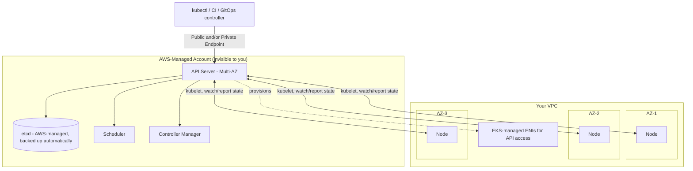

# Diagram 1: EKS Control Plane and Data Plane Architecture

## Key points
- The control plane (API server, etcd, scheduler, controller manager) runs in an AWS-owned account — you never see or manage its underlying compute, and etcd backup/durability is entirely AWS's responsibility.
- The data plane (nodes) runs in your VPC, across AZs you choose — multi-AZ resilience here is your design responsibility, not automatic.
- All interaction — human or automated — goes through the API server; there is no other path to change or observe cluster state.
- Endpoint access mode (public/private/both) controls where `CLIENT` can even reach the API server from — see [`docs/eks-architecture.md`](../docs/eks-architecture.md) §3.
