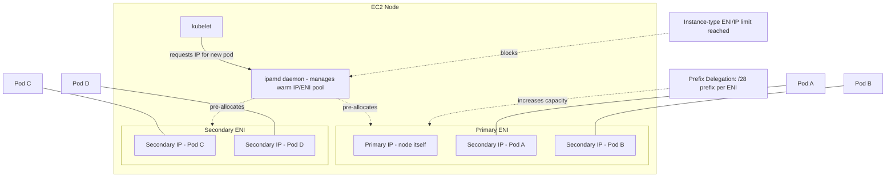

# Diagram 2: Pod Networking and VPC CNI ENI Allocation

## Key points
- Every pod gets a real, routable VPC IP — a secondary IP on one of the node's attached ENIs, not an overlay-network address.
- `ipamd` maintains a "warm pool" of pre-allocated IPs/ENIs so pod scheduling doesn't block on live AWS API calls in the common case.
- Pod density per node is capped by the instance type's max ENIs × max IPs per ENI — a distinct scaling limit from CPU/memory.
- Prefix delegation assigns a `/28` block per ENI instead of individual IPs, raising the pods-per-node ceiling substantially — see [`docs/networking.md`](../docs/networking.md) §2–3.
