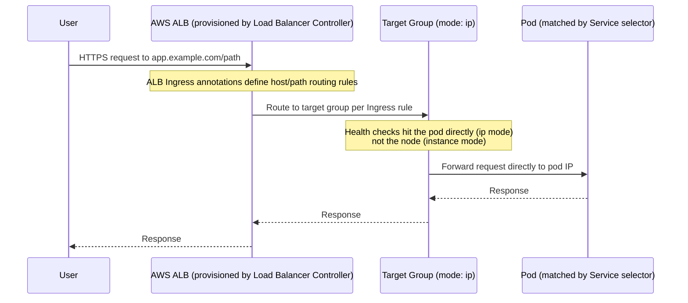

# Diagram 3: Request Path — Ingress → Load Balancer → Service → Pod

## Key points
- The AWS Load Balancer Controller (self-managed add-on) watches `Ingress`/`Service` objects and provisions/configures the real ALB/NLB and target groups — Kubernetes itself does not talk to AWS's load balancing APIs directly.
- Target group mode `ip` routes straight to the pod's own VPC-native IP, skipping the node hop that `instance` mode requires — the modern default for VPC-CNI clusters.
- Target-group health checks reflect pod-level health in `ip` mode, node-level health in `instance` mode — a real diagnostic distinction, see [`docs/networking.md`](../docs/networking.md) §5–6.
- A `Service` with zero matching endpoints (label-selector mismatch) breaks this entire chain silently — no error at the ALB layer, just failed requests. See [`docs/troubleshooting.md`](../docs/troubleshooting.md) §9.
