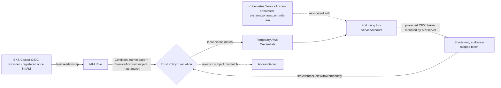

# Diagram 4: IRSA Trust Chain

## Key points
- The chain has four links: OIDC provider → IAM role trust policy → ServiceAccount annotation → pod's projected token. Every link must be correct for least-privilege to actually hold.
- The trust policy's `Condition` block must check both the OIDC provider **and** the specific namespace/ServiceAccount subject — omitting the subject check lets any ServiceAccount in the cluster assume the role.
- Tokens are short-lived and audience-scoped (via `TokenRequest`), automatically rotated by the kubelet — not a static, long-lived credential.
- A pod without an IRSA-annotated ServiceAccount silently falls back to the **node's** IAM role instead — see [`docs/iam-irsa.md`](../docs/iam-irsa.md) §2 and §7.
