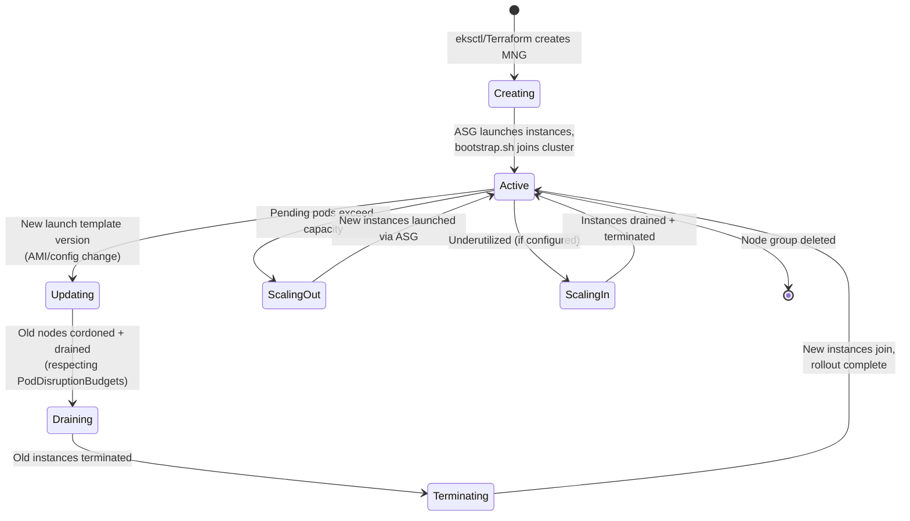

# Diagram 5: Managed Node Group Lifecycle

## Key points
- A managed node group's update process (new AMI/launch template) follows drain-then-replace semantics respecting `PodDisruptionBudget`s — the same conservative rolling-replacement discipline as the companion Terraform repository's ASG instance-refresh guidance.
- Scaling and updates are two distinct lifecycle events — don't conflate a routine scale-out with a version-upgrade rollout when diagnosing node churn.
- See [`docs/node-management-and-autoscaling.md`](../docs/node-management-and-autoscaling.md) §1 and [`docs/addons-and-upgrades.md`](../docs/addons-and-upgrades.md) §2 for the full cluster-upgrade sequencing this fits into.
