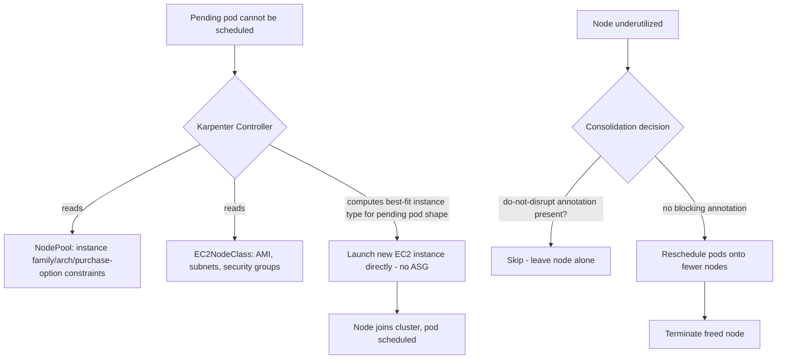

# Diagram 6: Karpenter Provisioning Decision Flow

## Key points
- Karpenter provisions EC2 instances directly — no pre-defined ASG or node group boundary constrains its instance-type choice; it picks the best fit for what's actually pending.
- Consolidation is a designed-in cost optimization, not a bug: nodes are actively terminated and workloads repacked when underutilized, unless a workload opts out via `karpenter.sh/do-not-disrupt`.
- This is a genuine architectural shift from Cluster Autoscaler's fixed-ASG-scaling model — see [`docs/node-management-and-autoscaling.md`](../docs/node-management-and-autoscaling.md) §2–3.
