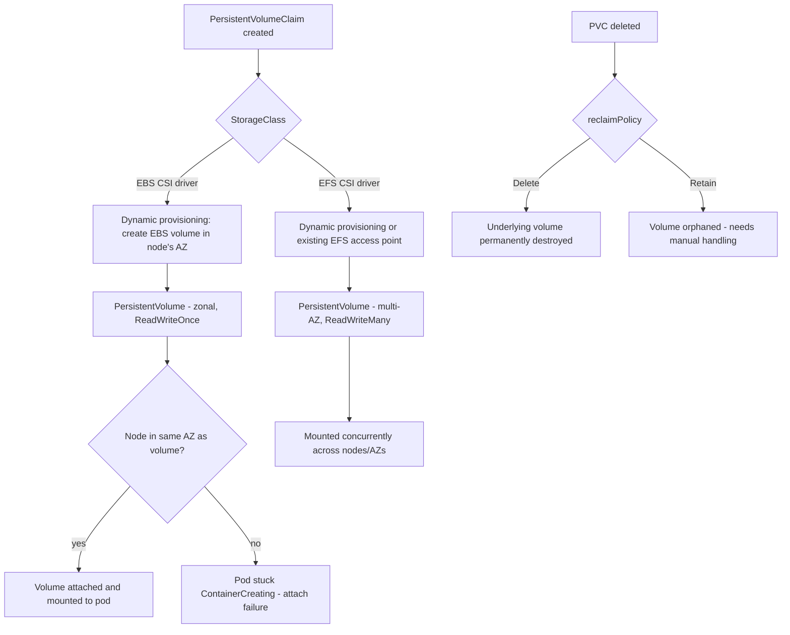

# Diagram 7: EBS/EFS CSI Volume Lifecycle

## Key points
- EBS volumes are zonal — a pod can only mount an EBS-backed PV if scheduled onto a node in the same AZ the volume lives in. This is a real scheduling constraint, not just a storage detail.
- EFS is multi-AZ and `ReadWriteMany` natively, at a different latency/cost profile than EBS.
- `reclaimPolicy: Delete` on a StorageClass backing important data with no separate backup is a silent data-loss trap — see [`docs/storage.md`](../docs/storage.md) §2–4.
