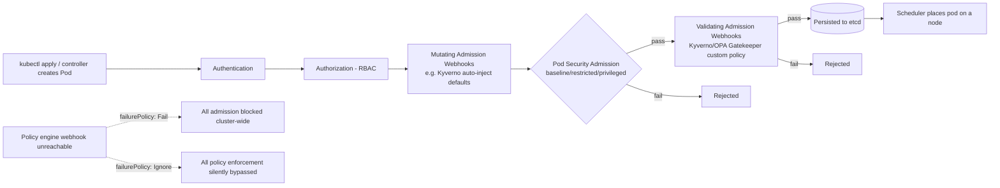

# Diagram 8: Pod Admission Flow

## Key points
- Every pod creation passes through this full chain — authentication, RBAC authorization, mutating webhooks, Pod Security Admission, then validating webhooks — before ever reaching etcd or the scheduler.
- Kyverno can mutate (inject defaults) as well as validate; OPA Gatekeeper's Rego-based Constraints are primarily validating.
- The policy engine's own availability is now a dependency of every admission-controlled operation — `failurePolicy` choice is a genuine, consequential trade-off. See [`docs/security.md`](../docs/security.md) §4 and [`docs/governance-policy.md`](../docs/governance-policy.md) §2.
