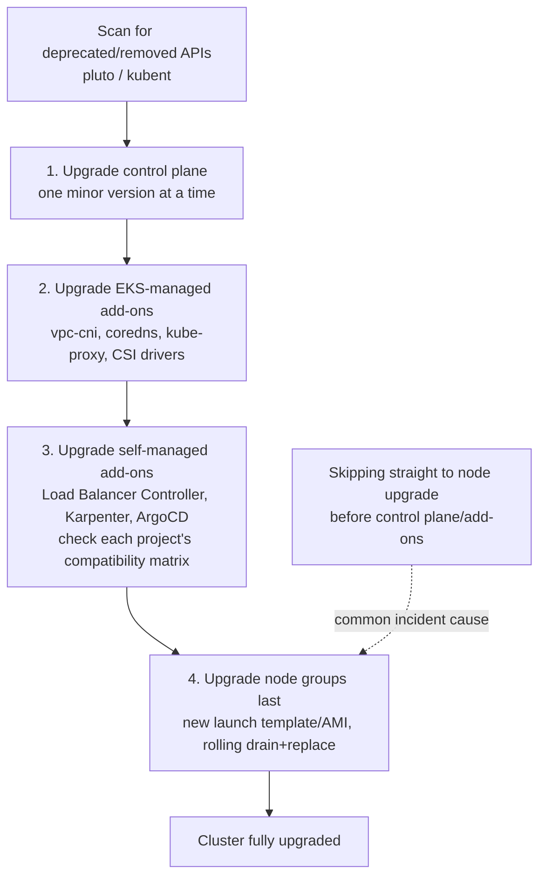

# Diagram 9: Cluster and Add-on Upgrade Sequencing

## Key points
- This order is not arbitrary: each step's compatibility assumptions depend on the previous step already being done — self-managed add-ons are checked against the *new* API version, which only exists after the control plane is upgraded.
- Node group upgrades are the actually disruptive step (existing pods get rescheduled) and should be paced conservatively, the same discipline as an ASG instance refresh.
- See [`docs/addons-and-upgrades.md`](../docs/addons-and-upgrades.md) §2 for the full reasoning.
