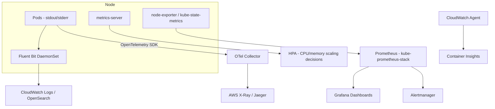

# Diagram 10: Observability Data Flow

## Key points
- `metrics-server` exists only to feed HPA/`kubectl top` — it has no history and is not a substitute for a real observability pipeline (Prometheus or Container Insights).
- Logs, metrics, and traces are three separate pipelines that must be deliberately correlated (e.g., via trace IDs in logs) during incident diagnosis, not three isolated tools.
- See [`docs/observability.md`](../docs/observability.md) for the Container-Insights-vs-Prometheus trade-off and alerting design guidance.
