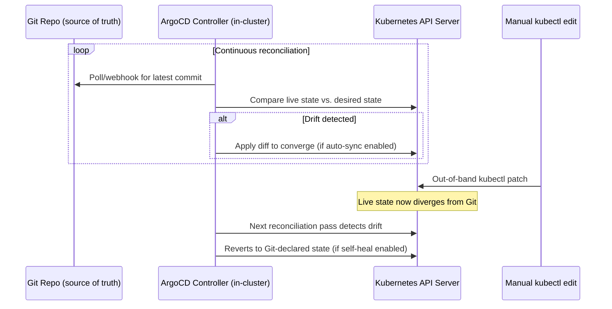

# Diagram 11: GitOps Reconciliation Loop (ArgoCD)

## Key points
- ArgoCD runs inside the cluster and continuously pulls/reconciles — a fundamentally different model from a CI pipeline pushing `kubectl apply` from outside.
- Any manual, out-of-band change to a GitOps-managed resource gets silently reverted on the next reconciliation pass (if self-heal is enabled) — Git is the actual, enforced source of truth.
- This gives genuinely continuous drift detection/correction, stronger than periodic `plan`/playbook-based drift checking. See [`docs/cicd-gitops.md`](../docs/cicd-gitops.md) §1–2.
