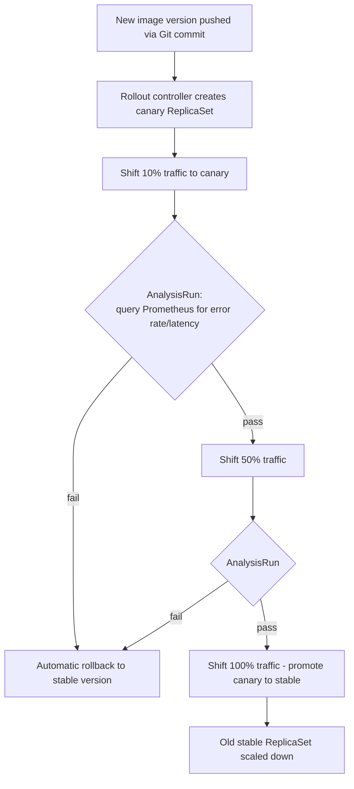

# Diagram 12: Progressive Delivery — Canary via Argo Rollouts

## Key points
- A standard Kubernetes `Deployment` has no traffic-weighted canary or automated metric-driven rollback — this requires the `Rollout` custom resource (Argo Rollouts) or Flagger.
- Promotion/rollback decisions are automated against real metrics (error rate, latency), not a human watching a dashboard and deciding.
- During an active canary, "what's serving production traffic right now" is only fully described by the Rollout's live status, not the Git-declared end-state alone. See [`docs/cicd-gitops.md`](../docs/cicd-gitops.md) §3 and §7.
