# Diagram 13: CI/CD Pipeline for Kubernetes Manifests

```mermaid
flowchart LR
    PR[Pull Request] --> LINT[Lint: yamllint, kubeval/kubeconform]
    LINT --> BUILD[Build + test application]
    BUILD --> IMAGE[Build container image]
    IMAGE --> SCAN[Scan image - Trivy/ECR scanning]
    SCAN --> SIGN[Sign image - Cosign]
    SIGN --> POLICYTEST[Policy test - kyverno test / gator test]
    POLICYTEST --> RENDER[Render manifests - kustomize build / helm template]
    RENDER --> DIFF[Diff against live cluster state - review only]
    DIFF --> MERGE{Approved and merged?}
    MERGE -->|yes| COMMIT[CI commits new image tag to GitOps repo overlay]
    COMMIT --> ARGO[ArgoCD picks up commit, reconciles cluster]
    MERGE -->|no| END[No cluster change]
```

## Key points
- CI's job narrows in a GitOps world: build, test, scan, sign, and update the Git-declared desired state — it does not itself deploy via `kubectl`/`helm upgrade`.
- The actual deployment step is the GitOps controller's own reconciliation, decoupled from the CI pipeline's completion.
- Policy tests (`kyverno test`/`gator test`) run pre-merge, catching a policy regression before it ever reaches a live admission webhook. See [`docs/cicd-gitops.md`](../docs/cicd-gitops.md) §6 and [`docs/governance-policy.md`](../docs/governance-policy.md) §4.
