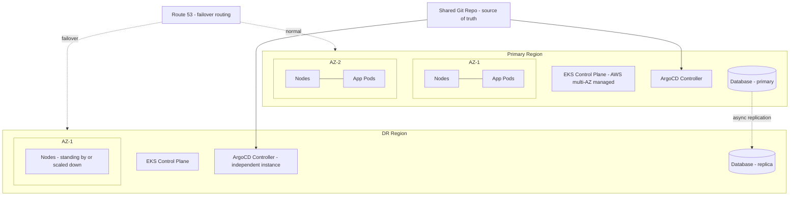

# Diagram 14: Multi-AZ / Multi-Region HA and DR Topology

## Key points
- Both regions' clusters reconcile from the *same* Git source independently — configuration convergence is automatic as long as each region's GitOps controller is healthy and reachable, per [`docs/ha-dr.md`](../docs/ha-dr.md) §6.
- Data (databases, PV contents) has no "just re-apply from Git" story — it needs genuine replication/backup-restore (Velero, database-level replication).
- The DR region needs its **own** GitOps controller instance — if only the primary region runs ArgoCD, you lose your reconciliation mechanism exactly when the primary region (and its ArgoCD) is what's down. See [`docs/ha-dr.md`](../docs/ha-dr.md) §7.
- Within each region, workload replicas must be explicitly spread across AZs (topology spread constraints) — the control plane's own multi-AZ resilience doesn't extend to workload placement automatically.
