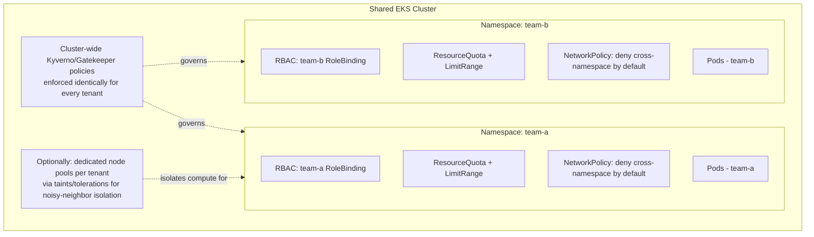

# Diagram 15: Multi-Tenant Cluster Isolation Model

## Key points
- Namespace-level isolation combines four layers: RBAC (who can act), ResourceQuota/LimitRange (how much they can consume), NetworkPolicy (what they can reach), and cluster-wide admission policy (baseline rules every tenant is subject to identically).
- Namespace isolation alone does not isolate compute — a noisy-neighbor workload in one namespace can still starve nodes shared with another tenant's namespace unless resource requests/limits and/or dedicated node pools are also in place.
- Cluster-wide policy (Kyverno/Gatekeeper) should apply uniformly across tenants — a tenant-specific policy exception is a deliberate, reviewed decision, not a default.
