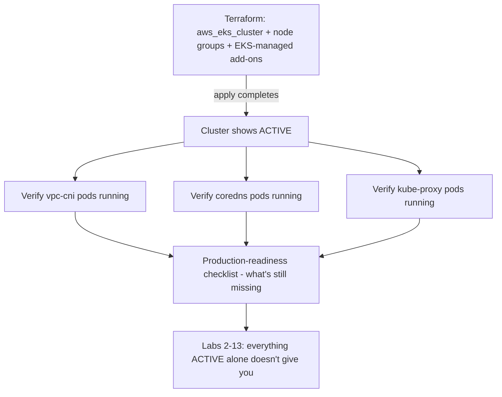

# Lab 1: Cluster Bootstrap

## Objective
Take a freshly-provisioned EKS cluster (via the companion Terraform repository) from `ACTIVE`-but-empty to genuinely usable — installing and verifying the EKS-managed add-ons that exist immediately post-provisioning, and confirming exactly what's present versus what's still missing before any real workload is deployed.

## Scenario
A `terraform apply` against the companion Terraform repository's EKS module just completed. Your team's new hire asks: "the cluster shows `ACTIVE` — can we deploy our application now?" This lab is the honest answer: walk through exactly what a bare, freshly-provisioned cluster actually has, confirm each EKS-managed add-on is genuinely healthy, and build the checklist for what's still needed before real production traffic (covered across the rest of this repository's labs).

## Skills Practised
- Distinguishing what Terraform's `aws_eks_cluster`/`aws_eks_addon` resources provide versus what remains a separate, post-provisioning step
- Verifying EKS-managed add-on health (`vpc-cni`, `coredns`, `kube-proxy`) directly, not assuming `ACTIVE` implies healthy
- `aws eks update-kubeconfig` and basic cluster access verification
- Building and using a production-readiness checklist as a genuine artifact, not just a mental note

## Architecture


## Prerequisites
- An EKS cluster provisioned via the companion [Terraform repository](../../../terraform/terraform-senior-interview-preparation/) (its EKS/networking labs), or an existing cluster you have admin access to
- `aws` CLI configured with credentials for the cluster's account
- `kubectl` >= 1.28
- **Cost warning**: an EKS control plane costs ~$0.10/hour regardless of node count, plus EC2/EBS costs for any node group. Budget for the full duration of working through this lab series, and tear down via the Terraform repo's `terraform destroy` when done with the whole series, not after every individual lab.

## Directory Structure
```text
lab-01-cluster-bootstrap/
├── README.md
├── verify-bootstrap.sh
└── production-readiness-checklist.md
```

## Step-by-Step Tasks
1. `aws eks update-kubeconfig --name <cluster-name> --region <region>` and confirm `kubectl get nodes` succeeds.
2. Run `verify-bootstrap.sh` — checks `vpc-cni`, `coredns`, and `kube-proxy` pods are all `Running`, not just that the EKS API reports the cluster as `ACTIVE`.
3. Run `kubectl get pods -A` and compare the output against `production-readiness-checklist.md`'s "what's here by default" section.
4. Attempt to create a `Service` of type `LoadBalancer` and observe it never gets an external address — confirming the AWS Load Balancer Controller (self-managed, not yet installed) is genuinely missing, not a misconfiguration.
5. Review the full `production-readiness-checklist.md` and note which items map to which later lab in this repository.

## Kubernetes Configuration
See [`verify-bootstrap.sh`](verify-bootstrap.sh) and [`production-readiness-checklist.md`](production-readiness-checklist.md).

## Commands to Execute
```bash
aws eks update-kubeconfig --name my-cluster --region us-east-1
kubectl get nodes
./verify-bootstrap.sh
kubectl get pods -A
```

## Expected Output
- `vpc-cni` (`aws-node` DaemonSet), `coredns`, and `kube-proxy` all show `Running` with no restarts.
- No Load Balancer Controller, no Karpenter, no ArgoCD, no observability stack — a bare cluster genuinely has none of these by default, confirming [`docs/eks-architecture.md`](../../docs/eks-architecture.md) §5's exact claim.

## Validation
```bash
kubectl get daemonset aws-node -n kube-system -o jsonpath='{.status.numberReady}'
kubectl get deployment coredns -n kube-system -o jsonpath='{.status.readyReplicas}'
```
Both should return a value matching your node count (for `aws-node`) or the configured replica count (for `coredns`) — confirming genuine health, not just object existence.

## Failure Injection
Cordon and drain a node (`kubectl cordon <node> && kubectl drain <node> --ignore-daemonsets`) and observe `aws-node`'s DaemonSet pod on that node terminates — then uncordon and confirm it's automatically rescheduled. This is a safe, reversible way to observe DaemonSet self-healing before you depend on it for anything real.

## Troubleshooting Exercise
Deliberately query the cluster's API server endpoint access configuration (`aws eks describe-cluster --name my-cluster --query 'cluster.resourcesVpcConfig'`) and confirm whether it's public-unrestricted, public-with-CIDR, or private — per [`docs/eks-architecture.md`](../../docs/eks-architecture.md) §3, assess whether this matches what you'd expect for this cluster's intended use, and note it in your checklist if it needs tightening before this cluster is production-ready.

## Cleanup
Not applicable to this lab specifically — this cluster is the foundation the remaining 14 labs build on. Tear down via the companion Terraform repository's `terraform destroy` only once you're done with the entire lab series.

## Interview Questions Connected to This Lab
- [Question 9: Where the Terraform apply ends](../../interview-questions/01-eks-cluster-architecture.md#question-9-where-the-terraform-apply-ends)
- [Question 4: The latency spike nobody could explain](../../interview-questions/01-eks-cluster-architecture.md#question-4-the-latency-spike-nobody-could-explain)
- [Question 2: The public endpoint nobody meant to leave open](../../interview-questions/01-eks-cluster-architecture.md#question-2-the-public-endpoint-nobody-meant-to-leave-open)

## Production Considerations
- A real organization would automate this entire bootstrap sequence (Labs 1–10) via a GitOps "App of Apps" pattern triggered automatically after Terraform provisioning completes — see [Lab 10](../lab-10-gitops-argocd/) and [Question 68](../../interview-questions/07-security-hardening.md#question-68-the-security-baseline-that-only-existed-in-one-cluster).
- Never treat a new cluster as production-ready until every item on `production-readiness-checklist.md` is checked and verified, not just assumed.

## Advanced Challenge
Write a small script that queries the EKS API for the cluster's current add-on versions (`aws eks describe-addon`) and cross-references them against the cluster's Kubernetes version's documented compatible add-on version range, flagging anything already out of date at the moment of first bootstrap.
