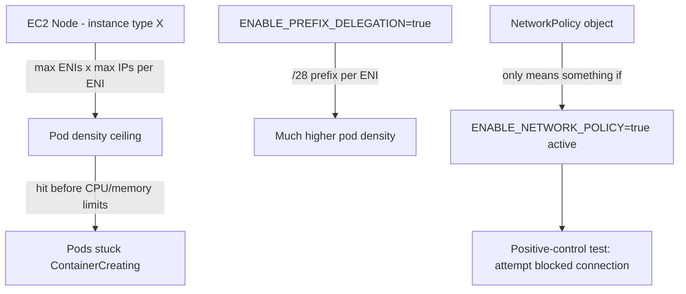

# Lab 2: Networking and VPC CNI

## Objective
Diagnose real pod-IP allocation behavior, enable prefix delegation to raise pod density, and verify NetworkPolicy enforcement is genuinely active — not just that policy objects exist.

## Scenario
Your node group's instance type is hitting its pod-per-node ceiling well before CPU/memory limits, causing pods to get stuck `ContainerCreating`. Separately, a security review needs proof that a NetworkPolicy actually blocks the traffic it claims to. This lab reproduces both, hands-on.

## Skills Practised
- Inspecting `ipamd` warm-pool state to diagnose IP exhaustion
- Enabling prefix delegation (`ENABLE_PREFIX_DELEGATION=true`)
- Native VPC CNI NetworkPolicy enforcement (`ENABLE_NETWORK_POLICY=true`)
- Positive-control testing: proving a NetworkPolicy blocks what it should, not just that the object exists

## Architecture


## Prerequisites
- A running EKS cluster (per [Lab 1](../lab-01-cluster-bootstrap/))
- A node group using a small instance type (e.g., `t3.small`) to make the pod-density ceiling easy to reach for this exercise

## Directory Structure
```text
lab-02-networking-vpc-cni/
├── README.md
├── manifests/
│   ├── deny-all-then-allow-netpol.yaml
│   └── ip-exhaustion-test-deployment.yaml
└── scripts/check-ipamd-state.sh
```

## Step-by-Step Tasks
1. Deploy `manifests/ip-exhaustion-test-deployment.yaml` (scaled well beyond the node's expected pod-IP capacity) and observe some pods stuck `ContainerCreating`.
2. Run `scripts/check-ipamd-state.sh` and confirm the specific CNI error referencing exhausted IP capacity.
3. Enable prefix delegation: `kubectl set env daemonset aws-node -n kube-system ENABLE_PREFIX_DELEGATION=true`.
4. Re-scale the deployment and confirm significantly more pods now schedule successfully on the same node.
5. Apply `manifests/deny-all-then-allow-netpol.yaml` and run the positive-control test (Step 6) **before** trusting it does anything.
6. Attempt a connection that should now be blocked (`kubectl run test --rm -it --image=busybox -- wget -qO- --timeout=2 http://target-service`) — if it still succeeds, check whether `ENABLE_NETWORK_POLICY=true` is actually set.
7. Enable native NetworkPolicy enforcement and re-run the positive-control test, confirming it's now genuinely blocked.

## Kubernetes Configuration
See [`manifests/`](manifests/) and [`scripts/check-ipamd-state.sh`](scripts/check-ipamd-state.sh).

## Commands to Execute
```bash
kubectl apply -f manifests/ip-exhaustion-test-deployment.yaml
./scripts/check-ipamd-state.sh
kubectl set env daemonset aws-node -n kube-system ENABLE_PREFIX_DELEGATION=true
kubectl set env daemonset aws-node -n kube-system ENABLE_NETWORK_POLICY=true
kubectl apply -f manifests/deny-all-then-allow-netpol.yaml
```

## Expected Output
- Before prefix delegation: several pods stuck `ContainerCreating` with a CNI IP-allocation error in `kubectl describe pod`.
- After prefix delegation: the same replica count schedules successfully.
- Positive-control connection test: blocked only after `ENABLE_NETWORK_POLICY=true` is actually set — never before, regardless of the NetworkPolicy object's presence.

## Validation
```bash
kubectl describe pod <stuck-pod> | grep -A5 Events
kubectl get daemonset aws-node -n kube-system -o jsonpath='{.spec.template.spec.containers[0].env}' | grep -o 'ENABLE_PREFIX_DELEGATION[^,]*'
```

## Failure Injection
This lab's entire IP-exhaustion scenario **is** the failure injection exercise. Additionally: disable prefix delegation again after confirming it worked, and confirm the pod-density ceiling returns — proving the fix is genuinely what resolved it, not an unrelated factor.

## Troubleshooting Exercise
Apply the NetworkPolicy **without** first enabling `ENABLE_NETWORK_POLICY`, declare it "working" based on the object existing (`kubectl get networkpolicy`), then run the positive-control test and observe the connection still succeeds — reproducing [Question 14](../../interview-questions/02-networking.md#question-14-the-networkpolicy-that-did-nothing) exactly, including the false confidence it describes.

## Cleanup
```bash
kubectl delete -f manifests/
kubectl set env daemonset aws-node -n kube-system ENABLE_PREFIX_DELEGATION- ENABLE_NETWORK_POLICY-
```
**Chargeable resources:** none beyond the already-running cluster/nodes from Lab 1.

## Interview Questions Connected to This Lab
- [Question 11: The subnet that ran out of room](../../interview-questions/02-networking.md#question-11-the-subnet-that-ran-out-of-room)
- [Question 14: The NetworkPolicy that did nothing](../../interview-questions/02-networking.md#question-14-the-networkpolicy-that-did-nothing)
- [Question 15: The DNS resolver that couldn't keep up](../../interview-questions/02-networking.md#question-15-the-dns-resolver-that-couldnt-keep-up)

## Production Considerations
- Prefix delegation requires node replacement to take full effect cleanly at scale — see [Question 20](../../interview-questions/02-networking.md#question-20-the-custom-networking-migration-that-took-down-new-pods) for the correct migration sequence.
- Never trust a NetworkPolicy claim without positive-control verification — build this into a standing, automated test, not a one-time manual check.

## Advanced Challenge
Deploy NodeLocal DNSCache and generate synthetic DNS query load, comparing CoreDNS's own CPU/request metrics before and after — reproducing [Question 15](../../interview-questions/02-networking.md#question-15-the-dns-resolver-that-couldnt-keep-up)'s fix quantitatively.
