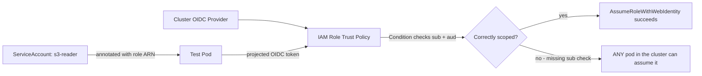

# Lab 3: IRSA and IAM

## Objective
Set up IRSA end-to-end for a test pod, deliberately misconfigure the trust policy to reproduce the "any ServiceAccount can assume this role" gap, then fix it — verified with a positive-control test in both directions.

## Scenario
A security review needs proof that your IRSA roles are genuinely scoped to the specific ServiceAccount they're intended for, not just "configured to look right." This lab builds a real IRSA role, breaks its trust policy the way it's most commonly broken, and proves both the vulnerability and the fix with actual `AssumeRoleWithWebIdentity` calls.

## Skills Practised
- The full IRSA trust chain: OIDC provider → IAM role trust policy → ServiceAccount annotation → pod token
- Writing a correctly-scoped trust policy `Condition` block (namespace + ServiceAccount subject, plus audience)
- Positive-control testing: proving both "the intended pod can assume this role" and "an unintended pod cannot"
- Auditing for ServiceAccounts silently falling back to the node IAM role

## Architecture


## Prerequisites
- A running EKS cluster with an OIDC provider registered (per [Lab 1](../lab-01-cluster-bootstrap/); the companion Terraform repository's EKS module typically registers this automatically)
- IAM permissions to create roles and policies

## Directory Structure
```text
lab-03-irsa-and-iam/
├── README.md
├── iam/
│   ├── trust-policy-BROKEN.json
│   ├── trust-policy-FIXED.json
│   └── permission-policy.json
└── manifests/
    ├── serviceaccount-s3-reader.yaml
    ├── test-pod-intended.yaml
    └── test-pod-unintended.yaml
```

## Step-by-Step Tasks
1. Create the IAM role with `iam/trust-policy-BROKEN.json` (only checks the OIDC provider, no `sub`/`aud` condition) and attach `iam/permission-policy.json` (scoped S3 read access to one test bucket).
2. Apply `manifests/serviceaccount-s3-reader.yaml` (annotated with the role ARN) and `manifests/test-pod-intended.yaml` (using that ServiceAccount) — confirm it can read the test S3 bucket.
3. Apply `manifests/test-pod-unintended.yaml` (a **different** ServiceAccount, with no IRSA annotation of its own, but manually configured to assume the same role ARN) — confirm it can **also** successfully assume the role, proving the vulnerability.
4. Update the IAM role's trust policy to `iam/trust-policy-FIXED.json` (adding the `sub`/`aud` condition scoped to the specific namespace/ServiceAccount).
5. Re-run both test pods — confirm the intended pod still works, and the unintended pod now gets `AccessDenied`.

## Kubernetes/IAM Configuration
See [`iam/`](iam/) and [`manifests/`](manifests/).

## Commands to Execute
```bash
export CLUSTER_NAME=my-cluster
export OIDC_PROVIDER=$(aws eks describe-cluster --name $CLUSTER_NAME --query "cluster.identity.oidc.issuer" --output text | sed 's|https://||')
export ACCOUNT_ID=$(aws sts get-caller-identity --query Account --output text)

# Substitute OIDC_PROVIDER/ACCOUNT_ID into the trust policy files, then:
aws iam create-role --role-name lab03-s3-reader --assume-role-policy-document file://iam/trust-policy-BROKEN.json
aws iam put-role-policy --role-name lab03-s3-reader --policy-name s3-read --policy-document file://iam/permission-policy.json

kubectl apply -f manifests/serviceaccount-s3-reader.yaml
kubectl apply -f manifests/test-pod-intended.yaml
kubectl apply -f manifests/test-pod-unintended.yaml
```

## Expected Output
- With the broken trust policy: **both** pods successfully assume the role and read the test bucket — the vulnerability, reproduced.
- With the fixed trust policy: only the intended pod succeeds; the unintended pod's `aws s3 ls` fails with `AccessDenied`.

## Validation
```bash
kubectl exec test-pod-unintended -- aws sts get-caller-identity
```
Before the fix: succeeds, showing the assumed role. After the fix: fails with an assume-role error.

## Failure Injection
This lab's entire structure **is** the failure-injection exercise — Steps 1–3 deliberately reproduce [Question 23](../../interview-questions/03-iam-irsa.md#question-23-the-trust-policy-that-trusted-everyone) before fixing it in Steps 4–5.

## Troubleshooting Exercise
Create a third pod using a ServiceAccount with **no** IRSA annotation at all, and confirm it still successfully makes an AWS API call (using the **node's** IAM role, silently) — reproducing [Question 24](../../interview-questions/03-iam-irsa.md#question-24-the-pod-that-fell-back-to-the-node). Check what permissions the node role itself grants, and assess whether this fallback is a real exposure for your test cluster's node role.

## Cleanup
```bash
kubectl delete -f manifests/
aws iam delete-role-policy --role-name lab03-s3-reader --policy-name s3-read
aws iam delete-role --role-name lab03-s3-reader
```
**Chargeable resources:** the test S3 bucket (negligible cost) — delete it too if created solely for this lab.

## Interview Questions Connected to This Lab
- [Question 23: The trust policy that trusted everyone](../../interview-questions/03-iam-irsa.md#question-23-the-trust-policy-that-trusted-everyone)
- [Question 24: The pod that fell back to the node](../../interview-questions/03-iam-irsa.md#question-24-the-pod-that-fell-back-to-the-node)
- [Question 34: Auditing IRSA at fleet scale](../../interview-questions/03-iam-irsa.md#question-34-auditing-irsa-at-fleet-scale)

## Production Considerations
- At fleet scale, this exact check (does every IRSA role's trust policy include a proper `sub` condition) should be automated per Question 34, not manually verified role-by-role.
- Consider EKS Pod Identity (Question 25) for new roles going forward — it removes the OIDC-condition boilerplate that caused this exact vulnerability class.

## Advanced Challenge
Automate this lab's positive-control test (Steps 2–3 and 5) as a script that can be run against any IRSA role ARN, taking the role ARN and expected ServiceAccount as parameters — turning this manual lab exercise into the reusable audit tool Question 34 describes.
